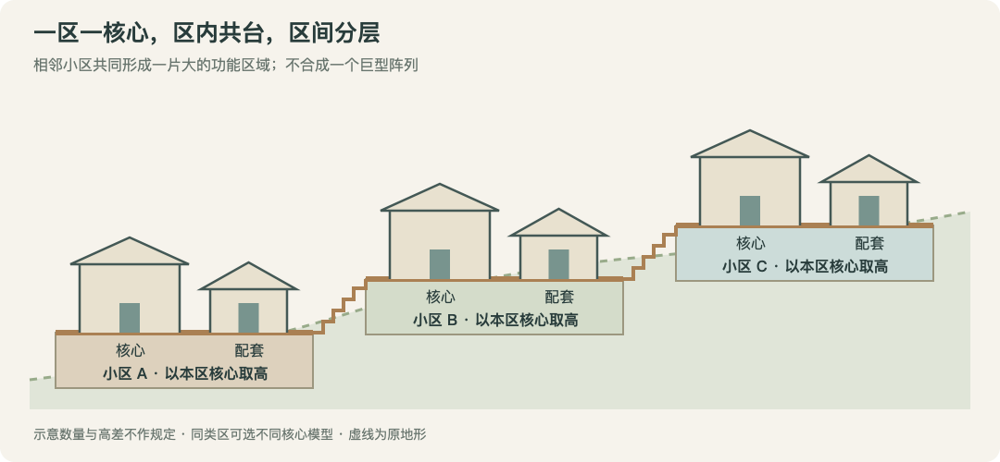

# 主建筑与分层台地

**设计中案 · 2026-10-05**。[返回总览](../../../../../../../10_product/城市设计与完整落地/README.md)。本页需求已确认，尚未接管实现。

主责任是城市基面。每个阵列功能区一个核心，本区台地跟随核心取高；相邻功能区组合出高低层次。

## 每区一个核心，多个同类区组成大片区域

<small>原话：“我们只需要把多个同类功能区连起来就能得到一片很大的功能区了。并且这片地方还很有层次”</small>

**AI 总结：** 一个实际参与阵列的功能区只有一个核心，配套围绕它组织。同类区可以相邻组合，不强制合并为一个大区。各小区分别确定台地高度，再由道路、阶梯或桥衔接。

[查看示意图](assets/主建筑与分层台地.svg)。图中表达已确认的组织关系；具体数量、尺寸与高差仅为示意，不要求所有相邻区必然不同高。

## 台地以核心的落地地面高度为基准

<small>原话：“台地就以核心建筑所在的那里取高度？”</small>

**AI 总结：** 在实际生成时，先确定**核心建筑的落地地面高度**，再让本区共享台地沿用它，不逐栋各取一套高度。取高看核心脚下的一片地面，避免单个小坑或突起决定整区；临水时结合水面与入口关系处理。由程序计算，不让 AI 填精确高度。

不同区各自取高，可以形成层次。核心数量与取高基准已随本轮确认，不再保留多核心方案作为并行选项。

## 不重复整套建筑组合

<small>原话：“我也很怕出现那种同质化现象，就是一大堆相同的建筑摆来摆去在一块地方。”</small>

**AI 总结：** 同类区可以采用不同核心和配套模型。拆区、增加台地或仅换材质都不自动解决同质化；D4 看建筑组合，生成后再看实际高低关系和通行效果。

2026-10-05 用户确认将以上结论写入案子，并关闭相应讨论。
