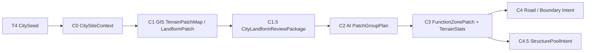

# City v0.1 案子：城市构造流程与功能区 Patch

## 定位

本案子承接 T4 `CitySeedRegistry` 之后的 City 首版实现。目标不是一次性生成完整大城，而是先把“城市周边局部精扫 -> 读取 GIS `LandformPatch` -> 给每个 patch 标注地貌名 + 编号 -> AI 按 patch 分组并配置功能 -> 生成 City `FunctionZonePatch` 并计算地形统计 -> 生成道路 / 边界意图 -> 预选结构池”的链路做成可验证、可 review 的最小闭环。

本案子属于 City 系统 C1-C4 主责，并向 C5 结构落地交接提供输入。它不重新决定国度边界，不扫描完整世界，不直接放置 jigsaw / prefab，也不替具体结构判断最终能否落地。

## 关键取舍

City v0.1 不重新定义地貌 tag，也不做重型“可建性”筛选。地貌事实来自 GIS `TerrainPatchMap` / `LandformPatch`；City 新生成的是 `FunctionZonePatch` / `FunctionZoneMap`。结构池预选单独成步，因为它需要读取功能区面积、尺寸估计、高度范围、水深、坡度、岸线等统计，并与结构 catalog 的 placement rules 对齐。最终能不能把某个结构放在某个具体位置，由结构池或结构条目自己的 placement rule 判断。

例如：

- 船、浮桥、码头结构自己声明必须在水上或贴岸。
- 法师塔、哨塔可以自己声明偏好悬崖、高地或山脊。
- 普通住宅可以自己声明最大坡度、最小 footprint、是否允许地基修整。
- 矿井入口可以自己声明需要靠近岩体、山麓或地下入口。

City 功能区层只告诉下游：“这个功能区是港口 / 住宅 / 防御 / 矿业，它引用了哪些 GIS 地貌 patch 作为证据，并提供哪些面积和地形统计”。结构池预选层再根据这些统计和结构 catalog 选 pool 候选，供后续 C5 AnchorPlan 和结构落地交接使用。City 不提前把大量位置过滤掉。

## 核心目标

1. 从 T4 的一个 `CitySeed` 锁定城市局部范围。
2. 在城市范围内执行或请求 C1 局部 GIS，得到 `TerrainPatchMap` / `LandformPatch`。
3. 从 GIS patch 中整理面积、邻接、`landformType`、GIS tags、metrics 和成员 cell 薄索引。
4. 把城市角色、国度风格、目标规模和 GIS 事实包交给 AI 设计功能区。
5. AI 只能基于图上的 patch 名称 / 编号做分组，例如 `[海岸01, 近海01, 平原05]`。
6. 程序把 AI 的 patch group 实体化成 City 自己的 `FunctionZonePatch`，并计算该功能区的面积、形状、高度范围、坡度、水体和岸线统计。
7. 生成粗道路、边界和连接意图。
8. 独立的结构池预选步骤读取 `FunctionZonePatch` 统计、功能需求和结构 catalog，输出 `StructurePoolIntent` 候选。
9. 具体结构落地限制由结构池 / 结构条目的 placement rule 配置。

## 阶段拆分

| 阶段 | 目标 | 首版输出 |
| --- | --- | --- |
| C0 | 锁定城市范围和局部扫描参数。 | `CitySiteContext` |
| C1 | 调用 GIS 局部精扫并取得地貌 patch。 | `TerrainPatchMap`、`LandformPatch[]`、`terrain_preview.png` |
| C1.5 | 导出整座城市的地理分块预览图，并附带 patch 图例、索引和证据表。 | `CityLandformReviewPackage` |
| C2 | AI 根据图上 patch 编号把地貌 patch 分组，并给 group 配功能。 | `PatchGroupPlan` |
| C3 | 程序把 group 实体化为功能区 patch，并计算功能区地形统计。 | `FunctionZonePatch[]`、`FunctionZoneMap`、`FunctionZoneTerrainStats` |
| C4 | 生成粗道路、边界和连接意图。 | `RoadIntent`、`BoundaryIntent` |
| C4.5 | 根据功能区统计和结构 catalog 预选结构池。 | `StructurePoolIntent` |

## C0：城市局部范围

输入来自 T4：

- `CitySeed.cityId`
- `CitySeed.realmId`
- `CitySeed.role`
- `CitySeed.scaleClass`
- `CitySeed.anchorBlock`
- `CitySeed.selectionEvidence`

首版范围建议：

| 规模 | 规划半径 | 局部 cell step | 说明 |
| --- | --- | --- | --- |
| `hamlet` | 160-240 blocks | 8-16 blocks | 首版小规模目标，通常承载 3-5 个结构意图。 |
| `village` | 256-384 blocks | 16 blocks | 首版推荐目标。 |
| `town` | 512-640 blocks | 16 blocks | 等村镇闭环稳定后再做；step 必须保持 GIS region 可整除。 |
| `city` | 768+ blocks | 32 blocks | 不作为 v0.1 首要验收；step 必须保持 GIS region 可整除。 |

范围必须裁剪到所属国度允许区域；如果城市靠近边境、水体或山体，允许保留少量上下文，但上下文不得进入 owned territory 之外的核心功能区。

## C1：GIS 局部地貌 Patch

C1 的 step 不能沿用 W 粗扫 step。W/T 粗扫用于宏观选点，C1 需要城市尺度的局部 GIS 事实。

本阶段产物归属 GIS，不归属 City。City 只消费 GIS 产出的 `TerrainPatchMap` / `LandformPatch`，不新造一套地貌 tag。

City 需要从 GIS patch 中读取：

| 指标 | 说明 | 典型来源 |
| --- | --- | --- |
| `patchId` | GIS 地貌 patch ID。 | `LandformPatch.patchId` |
| `landformType` | 主地貌类型，例如 plain、shore、terrace、slope、cliff、ridge、valley、basin。 | GIS |
| `memberCells` / `patchShape` | patch 真实形状或等价成员 cell。 | GIS |
| `areaBlocks` / `cellCount` | 面积与规模。 | GIS |
| `meanElevation` / `minElevation` / `maxElevation` | 高度事实。 | GIS |
| `meanSlope` | 平均坡度。 | GIS |
| `waterDistanceMean` / `touchesWater` | 水体距离与接触状态。 | GIS |
| `heightRange` / `depthRange` | 功能区和 pool 选择需要的高度 / 水深范围；如果 GIS patch 缺失，C3 需补局部统计。 | GIS / City C3 |
| `landformTags[]` / `overlayTags[]` | GIS 已有地貌和叠加标签；City 不新增同名 tag。 | GIS |
| `confidence` / `flags` | fragment、edgeDirty 等质量信息。 | GIS |

如果 City 需要额外规划上下文，例如接近国境、接近 T4 城市锚点、接近候选道路入口，应放在 `planningContext[]`，不能写回 GIS tag。

## C1.5：CityLandformReviewPackage

本阶段不是把 GIS patch 压缩成纯文本摘要，而是生成给 AI / 人类 review 的“城市地理分块图包”。主输入是整座城市范围的真实渲染地理分块预览图，结构化 JSON 只负责提供图例、patch 索引、成员 cell、metrics 和坐标换算。

- 地貌事实来自 GIS `LandformPatch`。
- AI 必须能看到整座城市范围内各 GIS patch 的相对位置、邻接关系、尺度、水体 / 高地 / 平缓区分布和 T4 城市锚点。
- City 只添加 `planningContext[]`，例如 `near_realm_border`、`near_city_anchor`、`near_water_crossing`。
- AI 可以根据地理分块预览图设计功能区，但只需要引用具体 `mapLabel` / `landformPatchRefs[]` 并说明规划理由。
- 最终结构是否可落地交给结构自己的规则。

### 1. 预览图要求

C1.5 的主产物是 `landform_review_map.png`，不是单纯 JSON 摘要。

预览图至少表达：

| 图层 | 说明 |
| --- | --- |
| GIS `LandformPatch` 填色 | 每个地貌 patch 使用稳定颜色，按 GIS `landformType` 区分。 |
| patch 边界 | 画出 patch 真实形状或成员 cell 边界，不用 envelope 假装真实形状。 |
| patch 编号 | 在 patch 中心或代表点标记“地貌名 + 序号”，例如 `平原01`、`海岸02`、`坡地03`，供 AI 在输出中引用。 |
| T4 城市锚点 | 标出城市种子中心和建议规划范围。 |
| 水体 / 岸线 | 明确显示水体、shore、riverbank / coast / lake 相关 GIS 事实。 |
| 高度 / 坡度辅助 | 可选叠加等高、阴影或坡度纹理，帮助 AI 理解相对地形。 |
| 国度边界上下文 | 如靠近国境，显示 owned / boundary / outside 的轻量遮罩。 |
| 网格与坐标 | 标出 block 坐标或局部网格，保证功能区草案能回到地图。 |

预览图的目标是保留空间关系：哪个 patch 靠水、哪个 patch 在山脚、哪个 patch 位于中心旁边、哪些 patch 相邻。JSON 摘要不能替代这张图。

### 1. 引用规则

| 规则 | 说明 |
| --- | --- |
| 不复制地貌体系 | City 不重新定义 `terrainTags[]`，不维护第二套地貌 tag。 |
| 引用 GIS 真值 | 功能区草案必须引用图上 `mapLabel` 或 `LandformPatch.patchId`，程序再回查 D3 索引中的地貌事实。 |
| 低置信降级 | `confidence` 低或带 `edgeDirty` / `fragment` 的 patch 可进入 debug，但不能作为功能区主依据。 |
| 语义分层 | GIS 地貌事实、City 规划上下文、AI 功能区意图必须分字段存储。 |
| 不写功能暗示表 | 不把“plain 适合住宅、ridge 适合塔”写成规则表；AI 可看图推理，但不需要回填 GIS tag / metric evidence。 |

### 2. Patch 索引

JSON 只做预览图的薄索引，不能替代预览图：

| 字段 | 说明 |
| --- | --- |
| `landformPatchId` | GIS `LandformPatch.patchId`。 |
| `mapLabel` | 预览图上显示的“地貌名 + 序号”，例如 `平原01`。 |
| `displayLandformName` | 给 AI / 人类看的地貌名，例如 `平原`、`海岸`、`坡地`、`山脊`。 |
| `centerBlock` | patch 中心。 |
| `blockBounds` | patch block 包围盒，用于回查和缺少成员格子时降级。 |
| `geometryMode` | 正常为 `patch_member_cells`，缺少成员格子时降级为 `patch_envelope`。 |
| `memberCells[]` | patch 的真实成员 cell 薄索引，供 D4 合并功能区 mask。 |
| `areaBlocks` / `cellCount` | 面积估算。 |
| `landformType` | GIS 主地貌类型。 |
| `landformTags[]` / `overlayTags[]` | GIS 地貌标签。 |
| `planningContext[]` | City 补充的非地貌上下文。 |
| `neighborLandformPatchIds[]` | 相邻 GIS patch。 |
| `metricsSummary` | 高度、坡度、水距、touchesWater、confidence、flags 等摘要。 |
| `areaClass` | `tiny`、`small`、`medium`、`large`，只表示 GIS patch 面积级别，不表示能建什么。 |
| `summaryFacts[]` | 机器生成的事实摘要，只能复述 metrics / tag / adjacency，不写功能建议。 |

不给 AI 传“常见功能暗示表”。AI 需要根据地图、城市角色和 GIS patch 事实自行提出功能区，输出引用的 patch 编号和分组理由即可。

## C2：AI PatchGroupPlan

AI 接收 `CityLandformReviewPackage` 后，输出 `PatchGroupPlan`。C2 的核心任务不是画任意多边形，而是把预览图上的 GIS patch 编号分成若干 group，并给每个 group 配置功能区语义。

AI 输出必须满足：

- 只能引用 `mapLabel` 或 `landformPatchId` 中存在的 patch。
- 一个 group 可以包含多个相邻或叙事上强相关的 GIS patch，例如 `[海岸01, 近海01, 平原05]`。
- 一个 GIS patch 可以被完整引用；如果确实需要拆分，必须声明 `splitRequested=true`，交给 C3 程序裁剪，AI 不直接画分割线。
- group 名称必须表达功能区语义，不得只复述地貌名。
- group 必须说明为什么这些 patch 应该组合。

| 字段 | 说明 |
| --- | --- |
| `groupId` | AI 输出的临时 group ID。 |
| `groupName` | group 名称，例如 `临海平原组`、`北坡住宅组`、`中心公共组`。 |
| `zoneName` | 转成 City 功能区后的名称，例如 `水岸市场`、`北坡住宅`。 |
| `functionType` | 功能类型。 |
| `patchLabels[]` | 使用哪些图上 patch 编号，例如 `["海岸01", "近海01", "平原05"]`。 |
| `landformPatchRefs[]` | 使用哪些 GIS `LandformPatch` 作为依据；可由 `patchLabels[]` 映射得到。 |
| `mainBuildingRole` | 主要建筑角色，例如 `village_hall`、`dock_core`、`mage_tower`。 |
| `supportingBuildingRoles[]` | 辅助建筑角色。 |
| `groupReason` | 为什么这些 patch 要合成一组；应能从预览图和 D3 索引回查。 |
| `adjacencyIntent` | 希望靠近 / 远离哪些功能区。 |
| `splitRequested` | 是否请求拆分某个 GIS patch；默认 false。 |

AI 不输出具体结构坐标，不输出 jigsaw 深度，不输出逐块可放置结论，也不在 C2 直接选择结构池。结构池选择进入 C4。

## C3：功能区实体化与地形统计

C3 将 AI 的 `PatchGroupPlan` 转成程序可校验的 City `FunctionZonePatch[]` / `FunctionZoneMap`。这是 City 新生成的 patch，区别于 GIS `LandformPatch`。

1. 将 `patchLabels[]` 映射回 GIS `landformPatchId`，检查引用存在。
2. 检查 group 中 patch 是否相邻或有明确 `groupReason` 支撑；无理由的远距离拼接进入 review。
3. 检查功能类型和主要建筑角色是否在配置表内。
4. 检查功能区规模是否大致匹配 `areaClass` 和城市目标规模。
5. 对同类功能允许多实例，例如 `北居住区`、`南居住区`、`水岸市场`。
6. 只做明显错误阻断，例如引用不存在的 patch、功能区完全不在城市范围内。
7. 不因坡度、水体、悬崖等直接否掉结构池选择；这些交给结构池内结构的 placement rule。
8. 合并引用 patch 的 `memberCells` 生成 `FunctionZonePatch.cellShape`；缺少成员格子时才显式降级到 envelope。
9. 计算 `FunctionZoneTerrainStats`，供 C4 道路 / 边界和 C4.5 结构池预选使用。

`FunctionZonePatch` 首版字段：

| 字段 | 说明 |
| --- | --- |
| `zonePatchId` | City 功能区 patch ID。 |
| `sourceGroupId` | 来源 AI group ID。 |
| `zoneName` | 功能区名称。 |
| `functionType` | 功能类型。 |
| `landformPatchRefs[]` | 该功能区引用的 GIS patch。 |
| `cellShape` / `memberCells` | 功能区真实形状，由引用 patch 的成员 cell 合并得到；缺少成员格子时降级为 envelope。 |
| `areaBlocks` | 功能区面积。 |
| `mainBuildingRole` | 主要建筑角色。 |
| `terrainStatsRef` | 该功能区的地形统计引用。 |
| `groupReason` | AI 对 patch 组合的理由。 |
| `generationNotes` | AI / 程序对功能区的简短说明。 |

`FunctionZoneTerrainStats` 首版字段：

| 字段 | 说明 |
| --- | --- |
| `zonePatchId` | 对应功能区 patch。 |
| `areaBlocks` | 面积。 |
| `shapeClass` | 紧凑、长条、岸线带、碎片等形状摘要。 |
| `heightMin/heightMax/heightMean` | 功能区高度范围，供道路、边界和结构 pool 规则使用。 |
| `waterDepthMin/waterDepthMax/waterDepthMean` | 水域功能区或贴水结构需要的水深统计。 |
| `slopeMean/slopeP90/slopeMax` | 坡度统计。 |
| `shorelineLengthBlocks` | 岸线长度。 |
| `waterContactRatio` | 功能区边界或 cell 与水体接触比例。 |
| `dominantLandformTypes[]` | 引用 GIS patch 的主地貌组成。 |
| `gisFlags[]` | fragment、edgeDirty、lowConfidence 等质量信号。 |
| `estimatedCapacity` | 按面积和形状估算的结构数量区间，不代表最终放置结果。 |

## C4：道路与边界意图

C4 根据 `FunctionZonePatch`、邻接关系、城市入口、核心功能区和地貌事实，输出粗道路和边界意图。它仍属于 City C1-C4 城市规划过程，不放置真实道路方块，也不生成结构。

首版只要求：

| 产物 | 说明 |
| --- | --- |
| `RoadIntent` | 入口到核心功能区的主连接、功能区之间的粗连接、道路等级和宽度意图。 |
| `BoundaryIntent` | 功能区之间的边界处理意图，例如道路、水岸、软过渡、栅栏、墙、绿化。 |
| `accessPoints[]` | 给 C5 anchor 和后续结构落地使用的接入点候选。 |

C4 不负责结构池选择，也不决定具体道路模板。

## C4.5：结构池预选与结构自判定

C4.5 根据 `FunctionZonePatch`、`FunctionZoneTerrainStats`、城市角色、国度风格和结构 catalog 输出 `StructurePoolIntent`。这是一个独立预选步骤，不混在 C2 AI patch group 中，也不替代 C5 AnchorPlan。

结构 pool 配置可能依赖具体参数，例如：

- 灯塔只能在指定高度区间的水域 / 岸线附近。
- 船只需要水深范围和水面面积。
- 小屋需要 footprint 范围、坡度上限和地基修整策略。
- 法师塔偏好 `ridge` / `cliff` / `terrace`，但仍由结构自身规则决定具体落点。

C4.5 不直接放建筑，也不对单个结构做最终可放置判断。它只输出结构池预选意图：

每个功能区输出 `structurePoolIntent`：

| 字段 | 说明 |
| --- | --- |
| `functionType` | 功能类型，例如 `residential`。 |
| `zoneId` | 所属功能区。 |
| `mainBuildingRole` | 主要建筑角色，例如 `dock_core`、`mage_tower`、`village_hall`。 |
| `structurePoolCandidates[]` | 推荐结构池 ID。 |
| `landformPatchRefs[]` | 该功能区引用的 GIS patch；详细地貌事实从 D3 索引和 `terrainStatsRef` 回查。 |
| `terrainStatsRef` | 功能区地形统计引用。 |
| `orientationHints` | 朝路、朝水、沿坡、朝广场，仅为提示。 |
| `densityIntent` | 稀疏、普通、密集。 |
| `budgetInputs` | zone 面积、城市规模、期望建筑数量。 |

具体结构条目自行配置 `placementRules`：

| 结构例子 | 自身规则例子 |
| --- | --- |
| `boat` | 必须在水上，附近允许码头连接点。 |
| `dock` | 必须贴岸，入口朝陆地或道路。 |
| `mage_tower` | 可偏好 GIS `cliff`、`ridge`、`terrace` 或高地 metrics，允许小 footprint。 |
| `small_house` | 需要普通陆地点和最小 footprint，允许轻微地基修整。 |
| `mine_entrance` | 可偏好 GIS 山麓 / 岩体 / cliff / slope 证据，入口朝外。 |

示例：

| 功能区 | 可选建筑 |
| --- | --- |
| `civic_core` | 村厅、井、主广场、公告牌、小型神龛。 |
| `residential` | 小屋、院落、街坊组、附属棚屋。 |
| `market` | 摊位、交易棚、仓库、公告栏。 |
| `farm_or_pasture` | 农田、围栏、畜棚、粮仓。 |
| `production` | 工坊、仓库、矿井入口、伐木场。 |
| `harbor_or_waterfront` | 码头、鱼市、船坞、小仓库。 |
| `defense` | 城门、岗楼、栅栏、壕沟、哨所。 |
| `sacred_or_cultural` | 神庙、纪念碑、学院、仪式平台。 |

## 数据产物草案

### CityLandformReviewPackage

| 字段 | 类型 | 说明 |
| --- | --- | --- |
| `schemaVersion` | string | 例如 `city_landform_review.v0.1`。 |
| `cityId` | string | 城市 ID。 |
| `grid` | object | 局部规划网格。 |
| `targetScale` | object | 根据 T4 城市规模和邻近 patch 面积推导的目标规模。 |
| `reviewMapImage` | string | 整座城市的地理分块预览图，AI 主输入。 |
| `legend` | object | 颜色、landformType、mapLabel、坐标和图层说明。 |
| `landformPatches[]` | object[] | GIS patch 摘要。 |
| `planningContext[]` | object[] | City 补充的非地貌上下文。 |
| `aiPromptContext` | object | 给 AI 的紧凑文字说明，只能解释 reviewMapImage、targetScale、图例和引用格式，不含功能建议表。 |
| `debugRefs` | object | 额外 GIS patch 图、指标图或审计文件。 |

`landformPatches[]` 推荐字段：

| 字段 | 类型 | 说明 |
| --- | --- | --- |
| `landformPatchId` | string | GIS `LandformPatch.patchId`。 |
| `mapLabel` | string | 预览图上的短编号。 |
| `centerBlock` | object | 中心坐标。 |
| `areaBlocks` | int | 面积估算。 |
| `landformType` | string | GIS 主地貌类型。 |
| `landformTags[]` | string[] | GIS 地貌标签。 |
| `overlayTags[]` | string[] | GIS 叠加标签。 |
| `areaClass` | string | `tiny`、`small`、`medium`、`large`，只表达面积级别。 |
| `metricsSummary` | object | 高度、坡度、水距、confidence、flags 等。 |
| `summaryFacts[]` | string[] | 仅复述 metrics / tag / adjacency 的事实句。 |

### StructurePoolIntent

| 字段 | 类型 | 说明 |
| --- | --- | --- |
| `schemaVersion` | string | 例如 `city_structure_pool_intent.v0.1`。 |
| `cityId` | string | 城市 ID。 |
| `zonePatchId` | string | 对应功能区 patch。 |
| `functionType` | string | 功能类型。 |
| `mainBuildingRole` | string | 主要建筑角色。 |
| `terrainStatsRef` | string | `FunctionZoneTerrainStats` 引用。 |
| `candidatePools[]` | object[] | 候选结构池及理由。 |
| `rejectedPools[]` | object[] | 因尺寸、高度、水深、坡度或缺少必要地貌证据被排除的 pool。 |
| `budgetInputs` | object | 面积、容量、期望建筑数量、密度意图。 |

`candidatePools[]` 至少记录：

| 字段 | 说明 |
| --- | --- |
| `poolId` | 结构池 ID。 |
| `fitReason` | 为什么可作为候选。 |
| `requiredPlacementRules[]` | 该 pool / 结构条目要满足的落地规则摘要。 |
| `estimatedCountRange` | 估算数量区间。 |

## 开发步骤

| 步骤 | 内容 | 完成口径 |
| --- | --- | --- |
| Step 1 | 建立 City v0.1 契约：`CitySiteContext`、`CityLandformReviewPackage`、`PatchGroupPlan`、`FunctionZonePatch`、`FunctionZoneTerrainStats`、`StructurePoolIntent`。 | 文档契约齐全。 |
| Step 2 | 实现 C0 从 T4 `CitySeed` 生成城市局部范围。 | 可选一个城市 seed 输出规划范围。 |
| Step 3 | 调用 GIS C1 局部精扫并读取 `TerrainPatchMap` / `LandformPatch` 预览。 | 真实存档能导出局部地貌图。 |
| Step 4 | 实现 C1.5 城市地理分块预览图、图例、GIS patch 索引和 AI 输入包。 | synthetic + 真实存档可解释。 |
| Step 5 | 实现 AI `PatchGroupPlan` 与 C3 `FunctionZonePatch` / `FunctionZoneTerrainStats`。 | 小村镇可生成 2-4 个功能区 patch，并输出面积 / 高度 / 水深 / 坡度统计。 |
| Step 6 | 实现 C4 `RoadIntent` / `BoundaryIntent`。 | 入口到核心区连通，功能区边界有处理意图。 |
| Step 7 | 实现 C4.5 `StructurePoolIntent`。 | 每个功能区有主要建筑角色、候选 pool、拒绝 pool 和匹配理由。 |

## 验收设计

### synthetic 场景

| 场景 | 期望 |
| --- | --- |
| 平坦内陆 | GIS patch 应包含 plain / terrace 等低坡地貌事实；AI 若选择居住、市场、农牧或公共核心，应引用图上的相关 patch。 |
| 河岸村镇 | GIS patch 应区分 shore / water / plain 等地貌；AI 若设计水岸市场或码头区，应引用图上的岸线相关 patch。 |
| 山麓矿城 | AI 若设计矿业 / 仓储功能区，应引用图上的 slope / cliff / ridge / exposed 相关 patch。 |
| 边境高地 | AI 若设计防御或塔类功能区，应引用图上的 ridge / terrace / cliff 相关 patch 和 City `near_realm_border` planning context。 |
| 林地村落 | AI 若设计林业、猎人或隐居建筑组，应引用图上的森林 / 资源相关 patch。 |

### 真实存档

从最近的 ReTerraForged 存档 T4 输出中选 1 个 `village` 或 `port` 城市：

1. 导出局部 `TerrainPatchMap`。
2. 导出 GIS 地貌 patch 图和 `CityLandformReviewPackage`。
3. 人工抽样 5-10 个 GIS patch，tp 过去验证 GIS patch / metrics / tags 是否靠谱。
4. 让 AI 根据上下文生成 2-4 个功能区草案。
5. 规范化为 `FunctionZonePatch[]` 并输出 `FunctionZoneTerrainStats`，检查功能区是否能解释地貌依据。
6. 运行 C4 道路 / 边界意图，检查入口到核心区是否连通，边界意图是否可解释。
7. 运行 C4.5 结构池预选，检查候选 / 拒绝 pool 是否能由功能区统计和 placement rules 解释。

## 风险与约束

- 水岸、坡地、悬崖、高地等地貌事实以 GIS `LandformPatch` 为准；City 不维护第二套同义 tag。
- 高坡、悬崖、高地不应被 City 层提前否掉；它们可能正是塔、神庙、防御和矿业结构需要的特色。
- GIS `LandformPatch` 不是 City `FunctionZonePatch`。一个地貌 patch 可被拆成多个功能区，一个功能区也可引用多个地貌 patch。
- 功能区不是建筑池。C3 功能区给语义、GIS patch 引用、成员格子形状和地形统计；C4 生成道路 / 边界意图；C4.5 才给候选 pool；具体结构给 placement rule。
- 首版可以让 AI 设计功能区草案，但程序要校验 GIS patch 引用和功能类型；结构池 ID 校验放在 C4。
