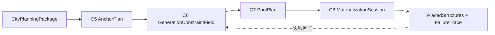

# C5-C8 结构落地交接过程

## 定位

C5-C8 已经进入结构落地范畴，不再视为 City 系统内部的城市规划步骤。City 系统只负责把 C1-C4 的规划结果转换成结构落地层可以消费的意图、边界、保留区和预算输入。

后续开始实现 Materialization 系统时，本文应迁移或拆分为对应系统的产品方案和契约入口。

## 过程分组

| 子过程 | 当前归属 | 目标 |
| --- | --- | --- |
| C5 AnchorPlan | 结构落地交接 | 锁定关键建筑和公共空间需求，避免普通结构抢占核心位置。 |
| C6 GenerationConstraintField | 结构落地交接 | 把功能区、道路、地形、水体、保留区转成硬约束和软代价。 |
| C7 PoolPlan | 结构落地 | 为各功能区选择结构池倾向，并由程序计算预算。 |
| C8 MaterializationSession | 结构落地 | 执行强化 jigsaw / prefab 放置，记录失败 trace。 |

## 总流程

## C5 AnchorPlan

目标：先确认关键建筑和关键公共空间的需求、候选范围和优先级。

输入：

- `FunctionZoneMap`
- `RoadNetworkPlan`
- `CityGrammarPlan`
- `CitySeed`

输出：

- `AnchorPlan`
- `ReservedAreaMap`

Anchor 示例：

- 新手村中心广场。
- 村厅、井、集市棚。
- 城门、港务核心、桥头。
- 神庙、纪念碑、学院。
- 矿井入口、仓库、哨塔。

约束：

- Anchor 不一定等于单个结构，也可以是公共空间或结构群中心。
- Anchor 必须有功能区归属、候选范围、优先级和失败策略。
- 普通 jigsaw / prefab 不得抢占 anchor 保留区。

## C6 GenerationConstraintField

目标：把城市规划转成可执行的结构放置约束。

输入：

- `AnchorPlan`
- `FunctionZoneMap`
- `BoundaryTreatmentMap`
- `RoadNetworkPlan`
- `TerrainPatchMap`

输出：

- `GenerationConstraintField`

约束场至少表达：

- 硬禁止：水体、陡坡、道路核心、保留区、越界、已有结构碰撞。
- 软代价：轻微坡度、离道路远、离功能区中心远、地貌不优、视线或风格不优。
- 方向偏好：朝路、朝水、沿坡、靠广场、贴城墙。
- 密度控制：功能区容量、留白、公共空间比例。

约束：

- C6 不修改城市语义。
- C6 不选择具体结构模板。
- C6 是程序约束层，不是 AI 文案层。

## C7 PoolPlan

目标：给每个功能区和 anchor 配置结构池倾向，并由程序求预算。

输入：

- `GenerationConstraintField`
- `CityGrammarPlan`
- `RealmProfile`
- 结构 catalog / prefab catalog

输出：

- `PoolPlan`
- `PlacementBudget`

预算原则：

- AI 可以给风格倾向，例如低矮、密集、木石混合、沿水展开。
- 程序根据可用面积、平均 footprint、道路保留、失败历史和机器预算计算 `piece_budget`、`radius`、`max_depth`。
- 预算必须可解释、可回放、可随失败 trace 调整。

## C8 MaterializationSession

目标：执行结构放置，并将失败原因回写给 C6 / C7。

输入：

- `PoolPlan`
- `PlacementBudget`
- `GenerationConstraintField`
- runtime template / jigsaw pool

输出：

- placed structure 列表。
- `MaterializationTrace`
- `FailureTrace`
- debug preview 或 report。

失败原因应能区分：

- 地形不合法。
- 碰撞。
- 道路或保留区冲突。
- 结构池没有可用模板。
- jigsaw 深度、半径或 piece budget 不足。
- 原版模板约束与规划约束冲突。

## City 到结构落地的交接包

City 系统向下游交付 `StructureLandingIntent`，不直接执行结构放置。

交接包应包含：

- 城市、国度、维度和坐标上下文。
- 功能区图和道路图索引。
- anchor 需求和候选范围。
- 保留区和禁止区。
- 边界处理对象。
- 结构池倾向。
- 预算计算所需的面积、形状、密度、道路接入点和地貌摘要。
- review 状态和质量评分。

## 最小可玩闭环

第一版结构落地交接只需要支持一个小型城市：

1. 一个中心 anchor。
2. 一条入口到中心的主路。
3. 2-3 个普通建筑功能区。
4. 3-5 个可放置结构或 prefab。
5. 失败时能输出原因，而不是静默跳过。
