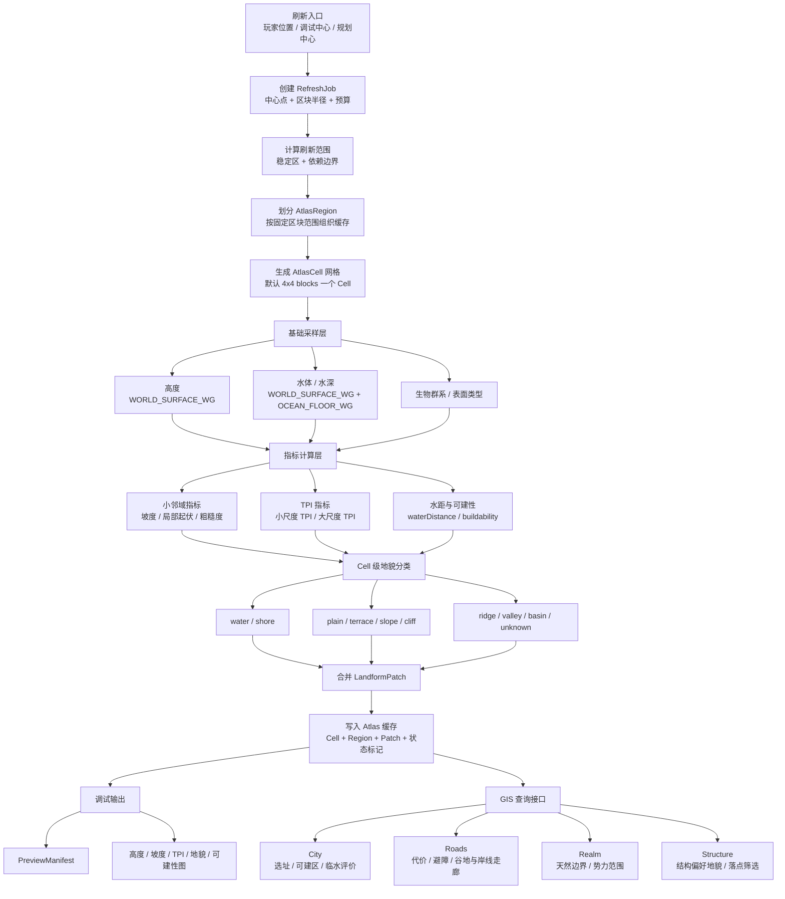

# GIS 主流程图

本文只描述 GIS 的主链路：它如何从一次范围刷新请求，生成可缓存、可预览、可被规划系统消费的地貌事实。

## 读图说明

GIS 的输入不是“生成城市”，而是一次地貌事实刷新请求。刷新请求会先拆成 `RefreshJob`，再按半径计算稳定区和依赖边界。稳定区给消费者使用，依赖边界主要用于 TPI、水距等邻域指标，避免边缘 Cell 误判。

`AtlasCell` 是整条链路的最小数据单元。它把 Minecraft 方块世界压缩成固定步长的栅格，首版建议 `4x4 blocks = 1 Cell`。后续坡度、TPI、可建性和地貌分类都基于 Cell 计算，而不是让每个消费者重复逐方块扫描。

指标层分两类：小邻域指标适合快速判断坡度和破碎程度，大邻域指标适合判断山脊、谷地、盆地、台地等区域地貌。依赖数据不足的 Cell 必须保留状态标记，例如 `edgeDirty`，不能假装已经稳定。

地貌分类先在 Cell 级完成，再合并成 `LandformPatch`。消费者优先查询 Patch，因为城市、道路、国度边界和结构分布更关心连续区域，而不是单个离散 Cell。

调试输出和查询接口是同一份 Atlas 的两个出口：调试图用于人工验收和阈值校准，查询接口用于后续系统消费。两者都不应该绕过 Atlas 重新扫描世界。

