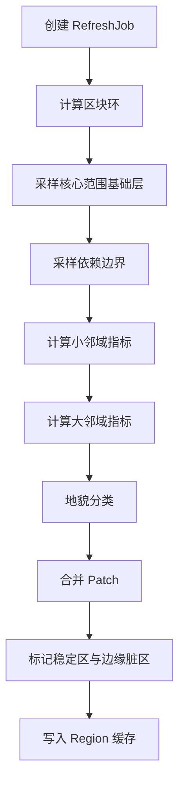

# 半径刷新与 Atlas 构建

GIS 首版采用“中心点 + 半径”的刷新方式。系统不尝试一次扫描全世界，而是围绕玩家、调试点或规划中心，按区块半径逐步构建 Atlas。

## 为什么按半径刷新

- Minecraft 世界天然按区块加载，按半径刷新更符合运行时访问方式。
- 城市和结构规划通常只需要中心附近的一段区域事实。
- 逐环刷新可以先产出核心区域，再慢慢补边缘区域。
- 边缘 Cell 的 TPI、水距等指标依赖外圈数据，按环刷新可以自然表达“核心已稳定，边缘待补全”。

## 刷新输入

| 字段 | 含义 |
| --- | --- |
| centerBlockX / centerBlockZ | 刷新中心的世界方块坐标。 |
| radiusChunks | 需要刷新的区块半径。 |
| dependencyMarginCells | 为邻域指标额外采样的 Cell 边界。 |
| cellStepBlocks | 一个 Atlas Cell 对应的方块步长，首版建议 4。 |
| priority | 任务优先级，例如调试手动刷新高于后台补全。 |
| budget | 每 tick 或每批次允许处理的 Cell 数量或耗时预算。 |

## 刷新流程

## Cell 状态

Atlas Cell 不应该只有“有/没有”两种状态。首版至少需要以下状态标记：

| 状态 | 含义 |
| --- | --- |
| sampled | 已完成高度、水体、生物群系等基础采样。 |
| metricsReadySmall | 坡度、局部起伏、小尺度 TPI 等小邻域指标可用。 |
| metricsReadyLarge | 大尺度 TPI、水距等更大邻域指标可用。 |
| landformReady | 地貌分类可用。 |
| patchReady | 已参与 Patch 合并。 |
| edgeDirty | 位于刷新边缘，后续外圈数据补齐后需要重算。 |

## 邻域依赖

不同指标需要不同范围的邻居 Cell。

| 指标 | 依赖半径 |
| --- | --- |
| 高度、水体、生物群系 | 0 |
| 坡度 | 1 cell |
| 局部起伏 | 1 到 2 cells |
| 粗糙度 | 1 到 2 cells |
| 小尺度 TPI | 2 到 3 cells |
| 大尺度 TPI | 6 到 12 cells |
| 水距 | 视搜索上限而定，通常需要单独缓存或分批传播。 |

这意味着每个 Cell 不必等“全世界”准备好，但必须等自己所需半径内的邻域数据准备好，才能计算对应指标。边缘区域可以先产出低可信结果，再标记为 `edgeDirty`。

## Region 切分

首版建议以固定区块范围作为 Atlas Region。一个可行默认值是 32x32 chunks，也就是 512x512 blocks。

在 `cellStepBlocks = 4` 时，一个 Region 约为 128x128 个 Atlas Cell。这个规模足够表达大地貌，也能避免逐方块扫描带来的成本失控。

## 稳定区与边缘区

刷新半径内应区分两层范围：

- stableArea：消费者可以直接使用的稳定区域。
- dependencyMargin：只用于计算邻域指标的外扩区域，不一定直接对消费者开放。

如果一个 Cell 的邻域依赖跨出了已采样范围，它仍然可以保留基础层，但指标层和地貌分类需要标记为不完整。

## 缓存策略

首版缓存分三层：

| 层级 | 作用 |
| --- | --- |
| 内存缓存 | 当前会话快速查询和刷新。 |
| Region 持久缓存 | 后续实现，用于跨会话复用 Atlas。 |
| 调试导出 | 预览图、摘要 JSON、验收报告，不作为主数据源。 |

主数据未来应使用紧凑二进制或 SavedData 索引承载，JSON 只承担配置和调试角色。

