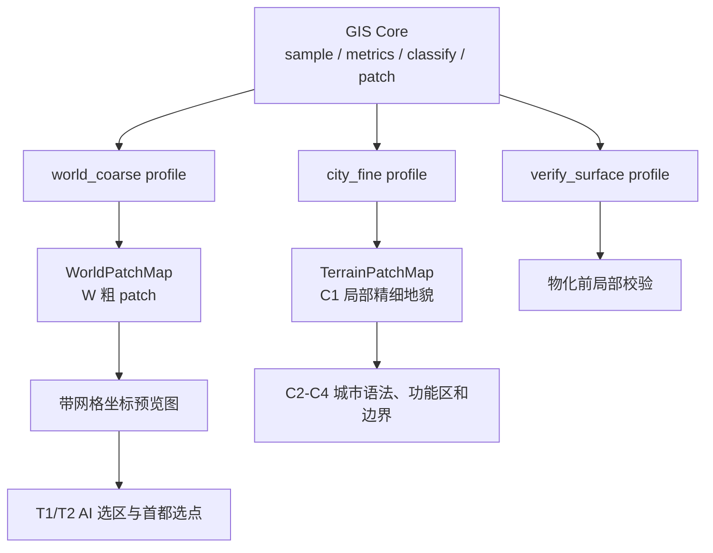

# GIS v1.1 开发计划：多分辨率 Atlas 与 W 粗 Patch

## 定位

本文记录 GIS v1.1 的开发计划。v1.1 在已落地的 GIS v1 基线上，增加不同采样步长的地貌扫描 profile，并把同一套 sample / metrics / classify / patch / preview 主链复用于 W 阶段世界粗扫和 C1 阶段城市局部精扫。

核心判断：

```text
W 粗 patch 不是另一套地貌系统；
它是 GIS 在 world_coarse profile 下生成的低分辨率 Landform Patch。
```

## 目标

- 复用 GIS 已有采样、指标、分类、Patch 合并和预览图逻辑。
- 允许同一维度按不同 profile 扫描，例如世界粗扫、城市精扫和物化前验证。
- 给 W 阶段提供粗尺度 WorldPatchMap，用于国度落脚、扩张背景和首都选点。
- 给 T1 / T2 输出带网格坐标的预览图，允许 AI 直接选择候选坐标。
- 避免 W 阶段为粗扫另建一套重复算法。

## 非目标

- 不重做 GIS v1 主链。
- 不让 W 粗 patch 决定城市内部边界、功能区、道路或结构落点。
- 不要求 W 阶段一次性扫描无限世界。
- 不把 coarse patch 当成 C1 的 TerrainPatchMap。
- 不在 GIS 内输出通用可建性评分。
- 不在本设计中引入真实 biome override。

## Profile 分层

GIS 应支持按用途选择 profile。profile 决定采样步长、指标半径、分类阈值、缓存命名和预览输出口径。

| Profile | 典型 step | 用途 | 消费者 |
| --- | --- | --- | --- |
| `world_coarse` | 64 / 128 / 256 blocks | W 阶段世界粗扫、粗 WorldPatchMap、国度落脚和首都选点。 | W / T |
| `city_fine` | 4 / 8 / 16 blocks | C1 城市候选范围内的 TerrainPatchMap。 | City / Roads / Structure |
| `verify_surface` | 1 / 2 / 4 blocks | 结构物化前的小范围后验校验。 | Materialization |

具体 step 不在本文拍死，应通过固定 seed、预览图和性能测试校准。

## 产物关系



## 实现改造点

### 1. Profile 配置

新增 GIS profile 概念。它至少要覆盖：

- `profileId`：例如 `world_coarse`、`city_fine`。
- `cellStepBlocks`。
- `regionSizeChunks`。
- `dependencyMarginCells`。
- 指标半径：slope、relief、roughness、TPI、水距上限。
- 分类阈值配置。
- 预览图比例和网格标注策略。

当前 `GisSampleConfig` 已经有 `cellStepBlocks`，可以作为 profile 化的基础；后续需要把入口层从固定 `defaults()` 改为按 profile 取配置。

### 2. 缓存隔离

同一维度、同一 region 坐标在不同 profile 下不能混用缓存。

推荐缓存 key 至少包含：

```text
dimensionId + profileId + regionX + regionZ + configVersion
```

否则 `step=4` 的城市精扫和 `step=128` 的世界粗扫会把同一个 region id 解释成不同网格，导致 patch、preview 和查询结果混乱。

### 3. 指标单位校准

当前指标半径以 cell 为单位。step 变大后，同样的 `tpiLargeRadiusCells = 12` 会代表更大的方块范围。

因此 profile 应显式区分：

- cell 半径：实现层计算单位。
- block 语义：文档、配置和调试报告中需要说明实际覆盖的方块尺度。

粗扫 profile 可以保留更大的 block 语义，但不能直接复用 city_fine 的阈值结论。

### 4. 分类阈值分组

不同 profile 需要独立校准分类阈值。

- `city_fine` 更关心局部坡度、岸线、台地和小丘陵。
- `world_coarse` 更关心大陆边缘、山系、盆地、海岸带、河流廊道和大平原。
- `verify_surface` 更关心真实落脚点附近的方块级风险。

阈值可以共享字段名，但不应共享同一组数值。

### 5. WorldPatchMap 输出

W 阶段消费的 WorldPatchMap 可以复用 LandformPatch 摘要，但应额外提供适合 AI / 人类 review 的地图输出：

- `landform.png`：粗地貌标记图。
- `patch.png`：粗 patch 边界和编号。
- `grid_overlay.png`：带网格坐标的选点图。
- `manifest.json`：记录 profile、step、范围、坐标换算、图层说明和生成时间。

AI 选点时返回格网坐标或候选点；程序必须把结果换算为世界坐标，并校验其属于目标大陆、目标 patch 或候选范围。

## 开发阶段

| 阶段 | 目标 | 主要产物 | 验收重点 |
| --- | --- | --- | --- |
| M0 文档定界 | 明确 W 粗 patch 是 GIS profile，不另建算法。 | 本文、主 workflow 引用。 | W / T / C 边界清楚。 |
| M1 Profile 配置 | 支持从入口选择不同 GIS profile。 | Profile 配置、入口参数、默认 profile。 | `city_fine` 保持旧行为，`world_coarse` 能独立运行。 |
| M2 缓存隔离 | Region / snapshot / preview 按 profile 隔离。 | profile-aware region key。 | 不同 step 的同一区域不会互相覆盖。 |
| M3 粗扫指标校准 | 为 `world_coarse` 校准指标半径和分类阈值。 | 粗扫配置、固定 seed 预览。 | 大平原、山系、水域、海岸带肉眼合理。 |
| M4 网格预览 | 输出带坐标网格的粗 patch 图。 | `grid_overlay.png`、manifest 坐标说明。 | AI / 人类能稳定读坐标，程序能换算回世界坐标。 |
| M5 W 调度接入 | W 阶段调用 `world_coarse` profile 生成 WorldPatchMap。 | W 粗扫任务、WorldPatchMap 输出目录。 | 能为 T1 / T2 提供候选图和 patch 摘要。 |
| M6 回归测试 | 覆盖多 profile 的稳定性和互不污染。 | 自动测试、固定样例报告。 | `city_fine` 旧测试不退化，`world_coarse` 有独立验收。 |

## 验收样例

最少准备三类固定 seed / 固定区域：

- 海岸 + 平原：验证海岸带、大平原和港口候选 patch。
- 山地 + 谷地：验证山系、山麓、谷地和盆地。
- 混合大陆边缘：验证粗 patch 不会碎到不可读，也不会粗到失去选点价值。

每个样例至少导出：

- progress manifest。
- landform preview。
- patch preview。
- grid overlay。
- patch 统计摘要。

## 风险

- step 变大后，指标数值语义会变化，不能只改 `cellStepBlocks` 就宣布可用。
- 粗 patch 容易把窄河、细岸线和小山丘抹掉；W 阶段可以接受，但 C1 不能接受。
- Region key 如果不带 profile，会产生严重缓存污染。
- 如果 AI 返回坐标没有经过程序校验，可能落到图像边界、海面、跨大陆或错误 patch。

## 推荐顺序

先做 profile 与缓存隔离，再做 `world_coarse` 预览和阈值校准。W 阶段接入应放在这些基础能力之后；不要为了 W 粗扫临时复制 GIS 主链。
