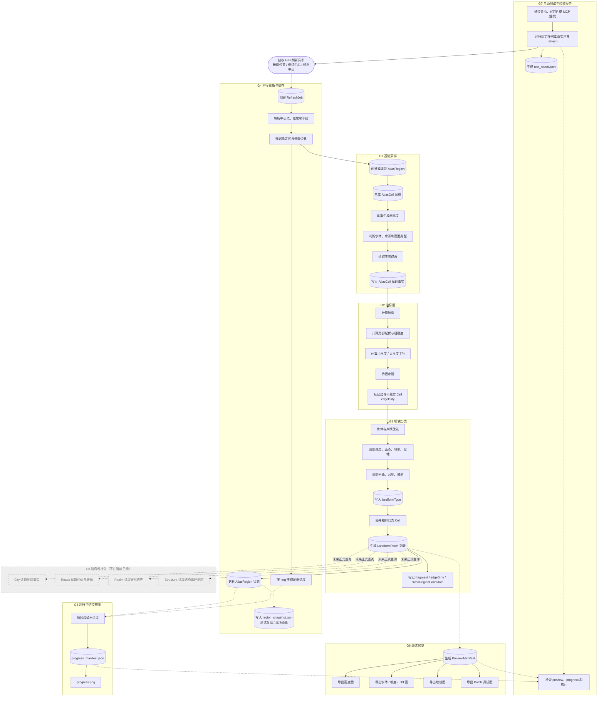

# GIS G1-G7 设计 Review 流程图

本文给人工 review 整体流程设计使用。G 编号沿用 `../../10_product/开发计划.md` 的阶段名；箭头表达运行时数据流和验收流，不要求 G 编号本身等同于严格调用顺序。

节点以中文过程为主，保留 `AtlasCell`、`AtlasRegion`、`RefreshJob`、`LandformPatch`、`PreviewManifest` 等数据结构英文名。若要看具体代码调用链，读 `GIS刷新代码流程图.md`。

## Review 读图口径

- G 编号来自开发计划，方便按阶段验收；箭头表达数据和验收如何流动。
- 看设计阶段是否漏了 G1-G7 中任一必要产物。
- 看某个改动是否跨阶段写错责任，例如在 G1 采样阶段做 G3 分类。
- 看调试旁路是否只用于验收和复现，不能回写成生产主数据。
- 看 G8 是否仍保持未来边界；当前 GIS v1 不要求消费者正式接入。
- 数据结构节点保留英文名，用来和契约文件、报告字段、代码对象对应。

## 当前特别注意

- G4 的 `region_snapshot.json` 是轻量快照，只服务测试复现和现场还原，不是完整生产级 SavedData 或二进制长期持久层。
- G3 当前已包含 `LandformPatch` 合并；实现中 `PatchMerger` 仍只做同类型四邻接合并。
- G6 的 patch 图当前是调试证据，不是 Patch 几何真值。
