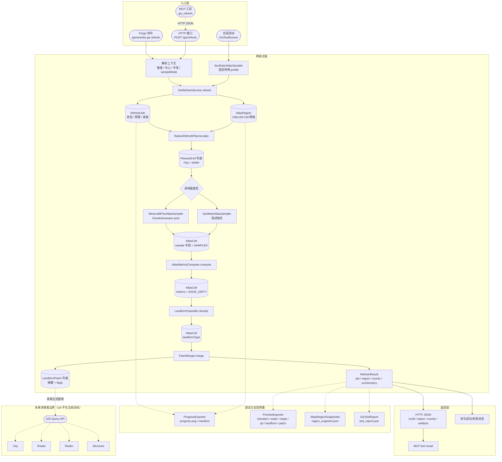

# GIS 刷新代码流程图

本文用代码视角展示 GIS 半径刷新主链。图中的主链、调试旁路、数据对象和未来消费者边界使用不同形状与连线区分；详细步骤见 `../flows/半径刷新实现指南.md`。

## 读图说明

- 粗主链从入口层进入 `GisRefreshService`，再依次经过 planning、sampling、metrics、classify、patch。
- 圆柱节点表示数据对象或契约对象，例如 `RefreshJob`、`AtlasRegion`、`AtlasCell`、`LandformPatch`。
- 虚线表示调试或复现旁路；这些产物用于验收，不是生产主缓存。
- `MCP -> HTTP` 是本地调试桥，不是 G8 消费者查询接口。
- 未来消费者边界只表达方向，不表示当前 GIS v1 已提供正式 query API。

## 当前实现限制

- `MinecraftPriorAtlasSampler` 当前实现 prior 采样；`observedIfLoaded` 和 `verifySurface` 后验分支尚未落地。
- `PatchMerger` 当前只做同类型四邻接合并。
- `LandformPatch` 当前保存摘要和 bbox，不保存成员 Cell 集合。
- `PreviewExporter` 的 `patch.png` 当前是 bbox overlay，不代表最终 Patch 轮廓。
