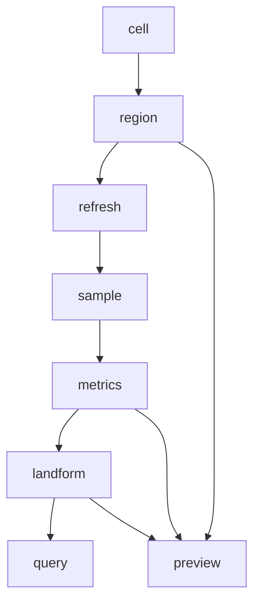

# GIS 代码导览

本文是 GIS 目标代码结构导览。当前实现仓库已经按本文分层落地 GIS v1 基线，后续代码应继续保持该分层，避免重回 legacy 式大文件堆叠。

## 推荐包结构

```text
com.rinsing.geomantia.world.atlas
com.rinsing.geomantia.world.atlas.cell
com.rinsing.geomantia.world.atlas.region
com.rinsing.geomantia.world.atlas.refresh
com.rinsing.geomantia.world.atlas.sample
com.rinsing.geomantia.world.atlas.metrics
com.rinsing.geomantia.world.atlas.landform
com.rinsing.geomantia.world.atlas.preview
com.rinsing.geomantia.world.atlas.query
```

如果实现仓库最终把 GIS 独立为 `gis` 包，也可以采用同样分层：

```text
com.rinsing.geomantia.gis.cell
com.rinsing.geomantia.gis.region
com.rinsing.geomantia.gis.refresh
com.rinsing.geomantia.gis.sample
com.rinsing.geomantia.gis.metrics
com.rinsing.geomantia.gis.landform
com.rinsing.geomantia.gis.preview
com.rinsing.geomantia.gis.query
```

## 模块职责

| 模块 | 职责 |
| --- | --- |
| cell | AtlasCell 数据结构、状态标记、基础字段访问。 |
| region | AtlasRegion 切分、缓存、Region 坐标转换。 |
| refresh | RefreshJob 调度、半径环刷新、预算执行、脏区管理。 |
| sample | 生成器先验采样、已加载 chunk 后验校正、局部表面验证。 |
| metrics | 坡度、局部起伏、粗糙度、TPI、水距等事实指标计算。 |
| landform | Cell 分类、Patch 合并、地貌类型规则。 |
| preview | 调试图导出、PreviewManifest 写出。 |
| query | 给 city、roads、realm、structure 使用的查询接口。 |

## 当前实现入口

实现仓库：`E:\Mod_Dev\StructureBinder`

| 模块 | 主要类 |
| --- | --- |
| 配置与版本 | `GisSampleConfig`、`GisClassifierConfig`、`GisAtlasConstants` |
| cell | `AtlasCell`、`CellStateFlag`、`LandformType`、`SampleSource`、`SurfaceType` |
| region | `AtlasRegion`、`AtlasRegionStore`、`RegionKey`、`RegionStatus`、`AtlasRegionSnapshotIo` |
| refresh | `RefreshJob`、`GisRefreshService`、`RadiusRefreshPlanner`、`RefreshResult` |
| sample | `AtlasSampler`、`MinecraftPriorAtlasSampler`、`SyntheticAtlasSampler`、`SyntheticTerrainProfile` |
| metrics | `AtlasMetricsComputer` |
| landform | `LandformClassifier`、`PatchMerger`、`LandformPatch`、`PatchFlag` |
| preview | `ProgressExporter`、`PreviewExporter`、`AtlasJson` |
| test | `GisTestCase`、`GisTestRunner`、`GisGameTests` |
| Forge 命令 | `com.rinsing.geomantia.platform.GisPlatformEvents` |
| HTTP/MCP 调试接口 | Java：`com.rinsing.geomantia.platform.http.GeomantiaHttpServer`、`GisHttpController`、`GisHttpUtil`；Node：`country_designer_mcp/src/gis/*` |

## 实现顺序

1. `cell` 和 `region` 先落地，保证数据结构独立可测。
2. `sample` 先实现 prior 模式，保证不主动生成 chunk 也能采样。
3. `refresh` 只做采样调度和状态推进，不直接塞分类规则。
4. `metrics` 逐个指标补实现，每个指标单独测试和预览。
5. `landform` 基于指标层做规则分类和 Patch 合并。
6. `preview` 作为验收工具尽早接入，不等全部功能完成。
7. `query` 最后提供稳定的消费者入口。

## 依赖方向



依赖原则：

- `metrics` 不依赖 `city`、`roads`、`realm`、`structure`。
- `landform` 不直接做城市选址。
- `query` 是消费者边界，消费者不应绕过它大范围扫描 Atlas 内部结构。
- `preview` 可以读取内部数据，但不应成为运行时主流程依赖。
- G8 消费者查询入口本轮未纳入目标，`query` 包暂不落地消费者 API。

## 文档对应关系

| 代码区域 | 对应文档 |
| --- | --- |
| cell | `../20_contracts/数据契约/AtlasCell.md` |
| region | `../20_contracts/数据契约/AtlasRegion.md` |
| refresh | `../10_product/功能设计/半径刷新与Atlas构建.md`、`../20_contracts/数据契约/RefreshJob.md` |
| metrics | `../10_product/功能设计/GIS指标层.md` |
| landform | `../10_product/功能设计/地貌分类与地貌区.md`、`../20_contracts/数据契约/LandformPatch.md` |
| preview | `../10_product/功能设计/预览图与调试图.md`、`../20_contracts/数据契约/PreviewManifest.md` |
| test | `../40_tests/测试入口.md`、`../40_tests/自动测试方案.md`、`../40_tests/结果报告.md` |
| HTTP/MCP 调试接口 | `../20_contracts/接口契约/GIS调试MCP接口.md`、`../40_tests/测试入口.md` |
