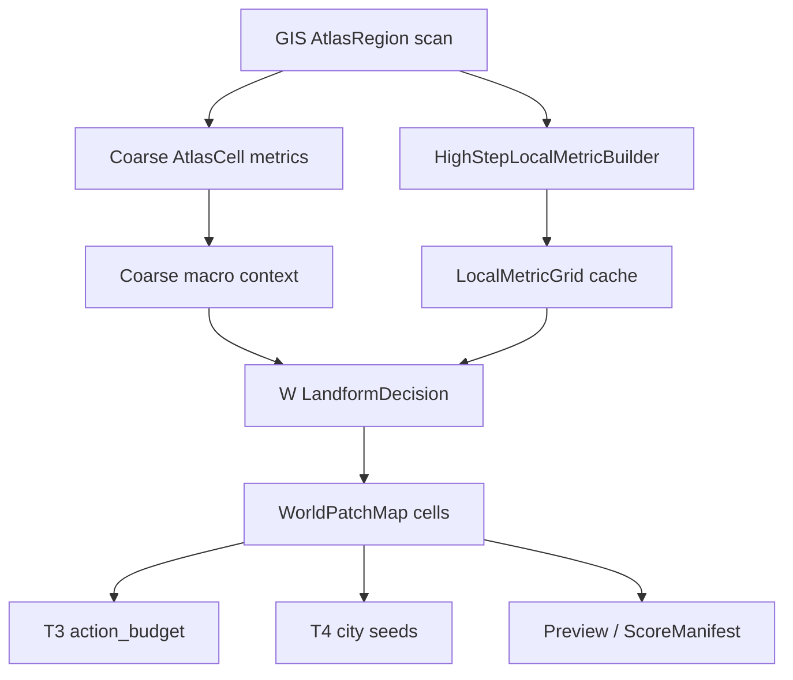

# 国度规划系统 v1.5 开发计划：高步长局部指标封装与地貌判定修正

## Summary

本轮目标是把 v1.3 已经落地的 micro-sampling 从 W runner 内部实现，整理成一层稳定的高步长局部指标封装，让 `cellStepBlocks=128` 这类 W 粗扫不再直接复用低 step GIS 的 slope / cliff 判定。

核心原则：

```text
低 step GIS 主链保持稳定。
高 step W 粗扫新增局部指标辅助层。
cliff / steep / shore 这类局部语义必须由局部证据确认。
ridge / valley / mountain_front 这类宏观语义仍可消费 coarse GIS 指标。
```

v1.5 不是推翻 GIS 架构。GIS 旧链路在 `cellStepBlocks=4/8/16/32` 时仍然有效，本轮只解决高 step 下“一个 cell 代表 128 block 后，邻格高度差不再等价于局部坡度”的语义问题。

## 背景

v1.3 已经实现：

- W 粗扫可使用 `cellStepBlocks=128`。
- `microSampleStrideBlocks=32` 时，每个 128 cell 内取 `4 x 4 = 16` 个 micro sample。
- 每个 micro sample 会额外读取东 / 西 / 南 / 北 `localSlopeRadiusBlocks=8` 的高度，聚合为 `heightStats`、`slopeStats`、`waterFrac` 和 `biomeHist`。
- `world_feature_grid.json` 可缓存，manifest 记录 `microSamplingImplemented=true` 和 `microSampleCount`。

但真实游玩抽样发现：

- 一些大尺度丘陵 / 海岸 / 山前地形仍被标记为 `cliff`。
- 图上 `cliff` 比例偏高，人工传送后看到的局部地形并不总是悬崖。
- 原因不是 micro 没有采样，而是旧 coarse GIS 的 `landform=cliff` 仍然能直接进入 W / T 消费层的 tag、预览和评分。

因此 v1.5 要完成的是“语义收口”：局部指标已经有了，但需要成为高 step 下局部地貌标签的权威输入。

## Scope

本轮包含：

- 新增或整理高 step 局部指标封装层，避免 micro 逻辑散落在 W runner 内。
- 明确 `cellStepBlocks`、`metricSampleStrideBlocks`、`localSlopeRadiusBlocks` 的职责边界。
- 调整 W 消费层地貌判定：`cliff` / `steep` 不再直接继承 coarse GIS landform。
- 将 coarse GIS 指标降级为高 step 下的宏观上下文，例如 ridge、valley、upland、mountain_front。
- 优化采样与缓存：先采样成局部 metric grid，再在内存中计算多个指标，减少重复 generator 查询。
- 更新预览和评分口径，让 `cliffRatio`、`steepTagRatio` 与 micro 证据一致。
- 补充 synthetic、JVM、真实游玩抽样验收。

本轮不包含：

- 不重写 GIS 主链的 `AtlasRegion` / `AtlasMetricsComputer` / `LandformClassifier` 基础架构。
- 不要求低 step GIS 改成 micro 模式。
- 不把 W 粗扫变成 C 阶段城市精扫。
- 不主动生成大范围 chunk；默认仍使用 prior 生成器采样。
- 不在本轮引入长期生产数据库。feature grid 缓存仍可先使用现有 JSON 产物。

## 设计目标

### 1. 保护原 GIS 架构

原 GIS 主链继续表达：

| 层 | 职责 |
| --- | --- |
| `AtlasRegion` | 固定区域分片和 AtlasCell 网格。 |
| `AtlasCell` | 单个采样 cell 的基础事实。 |
| `AtlasMetricsComputer` | 按 cell 邻域计算 slope、relief、roughness、TPI、水距。 |
| `LandformClassifier` | 在低 step / 常规 step 下把指标转成地貌。 |

这条链路在小 step 下仍然清楚、可解释、可复用。v1.5 不应为了 W 粗扫的高 step 问题破坏它。

### 2. 高 step 增加局部证据层

当消费层选择：

```text
cellStepBlocks >= 64
```

则启用高 step 局部指标封装：

```text
Coarse AtlasCell
  -> MicroFeatureGrid / LocalMetricGrid
  -> WorldFeatureCell
  -> W landform decision
```

高 step 下：

- coarse GIS 的 `slope` 是宏观高差信号，不再直接等价于局部坡度。
- coarse GIS 的 `localRelief` 是 cell 间或 region 内宏观起伏，不再直接等价于脚下地形破碎。
- `cliff`、`steep`、`shore`、`wet` 这种局部标签必须优先看 micro 证据。

### 3. 采样贵，计算便宜

性能瓶颈主要是调用 Minecraft generator / biome source 获取高度、水体、biome，而不是算 slope / TPI / percentile。

因此 v1.5 的采样原则是：

```text
一次采样，多指标复用。
先建局部 metric grid，再在内存中算 slope / relief / waterFrac / biomeHist。
```

不要让每个指标各自重复 `sampleElevation()`。

## 概念模型

### HighStepLocalMetrics

建议新增一层概念对象，名称可按实现习惯调整：

```text
HighStepLocalMetrics
  config
  cells[]
  cacheMeta
```

它不替代 `AtlasRegion`，只作为高 step 消费层的辅助事实。

### LocalMetricConfig

| 字段 | 默认值 | 说明 |
| --- | ---: | --- |
| `enabled` | `auto` | `cellStepBlocks>=64` 时默认启用。 |
| `metricSampleStrideBlocks` | `32` | coarse cell 内采样间隔。 |
| `localSlopeRadiusBlocks` | `8` | 每个 sample 的局部坡度半径。 |
| `adaptiveSampling` | `false` | 本轮可先保持固定 stride，后续再启用。 |
| `refineStrideBlocks` | `16` | 可疑区域加密采样步长。 |
| `maxSamplesPerCell` | `32` | 防止单 cell 采样失控。 |
| `sampleMode` | `prior` | 默认不主动生成 chunk。 |
| `cacheVersion` | `v1.5` | 进入 feature grid 配置 hash。 |

### LocalMetricCell

每个 coarse planning cell 聚合为：

| 字段 | 说明 |
| --- | --- |
| `gridX/gridZ` | planning cell 坐标。 |
| `sampleCount` | 当前 cell 实际 micro sample 数。 |
| `heightP10/P50/P90` | 高度稳健分位。 |
| `robustRelief` | `heightP90 - heightP10`。 |
| `slopeMean/slopeP90/slopeMax` | 局部坡度统计。 |
| `steepFrac` | 局部坡度超过 steep 阈值的样本比例。 |
| `waterFrac` | 水体样本比例。 |
| `shoreMixScore` | 水陆混合与边界可信度。 |
| `biomeHist` | biome 直方图。 |
| `sampleQuality` | `full`、`partial`、`edgeClamped`、`budgetLimited` 等。 |

## 采样方案

### 默认固定采样

对 `cellStepBlocks=128`：

```text
metricSampleStrideBlocks = 32
localSlopeRadiusBlocks = 8
```

每个 coarse cell：

```text
micro centers = 4 x 4 = 16
每个 center:
  sampleFeature(center): height / water / biome
  sampleElevation(center +/- 8 in X/Z): local slope
```

当前 v1.3 实现已经接近这个模型。v1.5 要做的是把它封装成独立 builder，并让消费层真正使用它。

### 中心点选择

micro center 应落在采样子格中心：

```text
blockX = cellMinX + xIndex * stride + stride / 2
blockZ = cellMinZ + zIndex * stride + stride / 2
```

这比取 coarse cell 左上角更稳定，避免采样点长期贴着 region / cell 边界。

### slope 计算

默认局部坡度：

```text
slope = max(
  abs(height(center + eastRadius) - height(center)),
  abs(height(center - westRadius) - height(center)),
  abs(height(center + southRadius) - height(center)),
  abs(height(center - northRadius) - height(center))
)
```

后续可扩展为 8 邻域，但 v1.5 不强制。4 邻域已经能避免 128 block 邻格高差误当局部 cliff。

### 自适应加密

v1.5 建议先把接口和报告口径准备好，但实现可以分两步：

1. 固定 `stride=32` 完成分类修正。
2. 再对可疑 cell 用 `stride=16` 加密。

可疑条件建议：

| 条件 | 说明 |
| --- | --- |
| coarse landform 为 `cliff` | 旧 GIS 认为是悬崖，需要 micro 复核。 |
| `waterFrac` 介于 `0.15..0.85` | 水陆混合，岸线容易被误判。 |
| `slopeP90` 接近阈值 | 边界 cell 需要更多样本。 |
| `robustRelief` 高但 `steepFrac` 低 | 可能是缓坡山前，不应叫 cliff。 |
| T3 / T4 候选点附近 | 消费层真正会使用，值得加密。 |

## 分类语义

### baseLandform

`baseLandform` 表达面状主地貌，建议保持有限枚举：

```text
water
shore
lowland
upland
ridge
valley
unknown
```

高 step 下不要把 `cliff` 作为 `baseLandform`。悬崖不是一整片 128x128 cell 的面状主地貌，而是局部边缘或高成本标签。

### landformTags

`landformTags[]` 承载二级语义：

```text
steep
cliff
coastal
wet
rugged
mountain_front
ridge_context
valley_context
```

其中：

- `steep` 必须由 micro `slopeP90` 或 `steepFrac` 支撑。
- `cliff` 必须由更强的 micro 局部坡度证据支撑。
- coarse GIS 的 `landform=cliff` 只能生成 `cliff_candidate` 或 `mountain_front`，不能直接生成正式 `cliff`。

### 建议阈值

第一版建议：

| 标签 | 条件 |
| --- | --- |
| `steep` | `slopeP90 >= 14` 或 `steepFrac >= 0.25` |
| `cliff` | `slopeP90 >= 18` 且 `steepFrac >= 0.35`；若 `waterFrac` 为 `0.05..0.95` 的水陆混合海岸，`steepFrac` 提升到 `>= 0.45` |
| `rugged` | `robustRelief >= 18` 且 `steepFrac < 0.25` |
| `coastal` | `waterFrac > 0.05` 且 `waterFrac < 0.95`，或 coarse 水距足够近 |
| `shore` base | `waterFrac` 介于水陆混合阈值，且局部坡度不过高 |
| `upland` base | `robustRelief >= 12` 或 coarse ridge / upland 上下文 |
| `ridge` base | coarse `tpiLarge` / patch 形态支持，且不是水体 |
| `valley` base | coarse `tpiLarge` 明显为负，且水体比例不覆盖主体 |

阈值应进入配置或常量集中管理，不能散落在不同消费层。

### 关键修正

高 step 下禁止：

```text
if coarseLandform == "cliff":
  tags.add("cliff")
```

应改为：

```text
if micro confirms cliff:
  tags.add("cliff")
else if coarseLandform == "cliff":
  tags.add("mountain_front" or "rugged")
```

这能解释用户人工传送看到的现象：远处有山前 / 高差 / 海岸，但脚下局部并不是 cliff。

## 数据流

v1.5 目标数据流：



`LandformDecision` 是建议新增或整理的消费层函数，不要求命名完全一致。它负责把 macro context 和 local metrics 合并为 W/T 可消费地貌。

## 实现建议

### Step 1：抽出 HighStepLocalMetricBuilder

把当前 `WorldSurveyRunner` 中的 micro 逻辑整理为独立类：

```text
systems/realm_planning/metrics/HighStepLocalMetricBuilder
systems/realm_planning/metrics/LocalMetricConfig
systems/realm_planning/metrics/LocalMetricCell
```

或如果更适合放 GIS 包，也可以放在：

```text
systems/gis/application/local_metrics
```

建议第一阶段仍放 realm_planning，因为它的直接消费者是 W 粗扫，避免让 GIS 主链承受尚未稳定的 W 特化语义。

### Step 2：采样缓存与 config hash

`world_feature_grid.json` 的 hash 至少包含：

- dimension id
- seed / world identity
- scan bounds
- `cellStepBlocks`
- `metricSampleStrideBlocks`
- `localSlopeRadiusBlocks`
- adaptive sampling 开关
- sample mode
- cache schema version

配置不一致时不得复用旧 feature grid。

### Step 3：W LandformDecision

新增或整理一个单点决策入口：

```text
WorldCellLandformDecision decide(
  coarseCell,
  coarseMetrics,
  localMetricCell,
  classifierConfig
)
```

输出：

```text
baseLandform
landformTags[]
terrainCosts hints
debugReasons[]
```

`debugReasons[]` 用于验收抽样时解释为什么一个点被标为 `cliff`、`steep`、`shore` 或 `upland`。

### Step 4：修正 tag 消费

W / T 消费层统一改成：

- `cliff` tag 看 micro confirmation。
- `steep` tag 看 micro `slopeStats`。
- `mountain_front` 可由 coarse macro context + micro rugged 共同决定。
- `baseLandform` 不再输出 `cliff`。

### Step 5：预览图修正

`world_patch_preview.png` 默认按 `baseLandform` 着色：

| 地貌 | 显示 |
| --- | --- |
| `water` | 水色 |
| `shore` | 岸线色 |
| `lowland` | 低地色 |
| `upland` | 高地色 |
| `ridge` | 山脊色 |
| `valley` | 谷地色 |
| `unknown` | 中性灰 |

`cliff` / `steep` 用叠加层或单独 debug preview 显示，避免一张主预览被局部风险标签染成大面积 cliff。

### Step 6：评分修正

`ScoreManifest` 中 W 子分至少区分：

| 字段 | 说明 |
| --- | --- |
| `baseLandformDistribution` | 面状主地貌占比。 |
| `landformTagDistribution` | tag 占比。 |
| `cliffTagRatio` | 真实 cliff tag 占比。 |
| `steepTagRatio` | steep tag 占比。 |
| `coarseCliffCandidateRatio` | 旧 GIS cliff 候选占比，仅作诊断。 |
| `microContradictionRatio` | coarse cliff 但 micro 不支持的比例。 |

strict 模式中：

- `cliffTagRatio` 过高且没有 micro 支撑应 warning / hard block。
- `microSamplingImplemented=false` 时不能宣称高 step strict W 质量通过。

## 测试计划

### Synthetic / JVM

| 用例 | 预期 |
| --- | --- |
| 平原 128 cell | `baseLandform=lowland`，无 `steep/cliff`。 |
| 缓坡山前 | 可为 `upland/mountain_front`，但不应是 `cliff`。 |
| 真悬崖边 | `steep` 和 `cliff` tag 必须有 `slopeStats` 支撑。 |
| 水陆混合海岸 | 优先 `shore/coastal`，不能因远处高差变 cliff。 |
| 粗 GIS cliff 但 micro 平缓 | 输出 `microContradiction`，不输出正式 `cliff`。 |
| step=16 低 step | 旧 GIS 分类结果保持兼容，不强制走 high-step layer。 |

### 接口 / 产物

- `world_feature_grid.json` 写入 v1.5 config 字段。
- `world_patch_map.json` 中每个 cell 有 `baseLandform`、`landformTags`、`heightStats`、`slopeStats`、`waterFrac`。
- `score_manifest.json` 区分 `cliffTagRatio` 和 `coarseCliffCandidateRatio`。
- 同 run cache 命中时不重建 feature grid。
- 修改 stride / slope radius 后 cache 不复用。

### 开发期 Tag Audit

新增一个开发期检验方法，用少量点的局部精确扫描评估 W 粗扫 tag 是否可信。它不替代真实游玩验收，但应成为每轮调参后的默认质量闸门。

流程：

1. 从 `world_patch_map.json` 分层抽样。
2. 对抽中的 block 点执行局部精确扫描。
3. 用局部扫描事实重新判定 reference tags。
4. 将 W 粗扫输出 tags 与 reference tags 对比。
5. 输出正确率、误报、漏报和混淆矩阵。

抽样分层：

| 分层 | 目标 |
| --- | --- |
| confirmed `cliff` tag | 检查 cliff precision，避免误报。 |
| confirmed `steep` tag | 检查 steep precision。 |
| coarse cliff candidate 但 micro rejected | 检查修正是否合理。 |
| `shore/coastal` | 检查水陆混合和岸线标签。 |
| `upland/ridge/mountain_front` | 检查宏观高地不被误叫 cliff。 |
| 随机 land baseline | 估算普通陆地误报率。 |

局部精确扫描建议默认：

```text
auditRadiusBlocks = 32
auditStrideBlocks = 4
centerSlopeRadiusBlocks = 4
sampleMode = observedIfLoaded 或 prior
```

每个抽样点扫描 `65 x 65` 范围内的规则网格，计算：

| 指标 | 说明 |
| --- | --- |
| `heightP05/P50/P95` | 比 W micro 更稳的局部高度分位。 |
| `reliefP95P05` | 局部精确起伏。 |
| `slopeP90/slopeP95/slopeMax` | 局部坡度分布。 |
| `steepFrac` | 精扫样本中陡坡占比。 |
| `waterFrac` | 精扫水体占比。 |
| `shoreMixScore` | 水陆混合程度。 |
| `dominantBiome` / `biomeHist` | 局部 biome 事实。 |

reference tag 判定应与 W 判定使用同一套阈值语义，但基于更密的局部扫描事实。例如：

```text
referenceSteep = slopeP90 >= 14 或 steepFrac >= 0.25
referenceCliff = slopeP95 >= 18 且 steepFrac >= 0.35
如果 waterFrac 在 0.05..0.95 之间，referenceCliff 的 steepFrac 阈值提升到 0.45
referenceCoastal = waterFrac 在 0.05..0.95 之间，或局部水距足够近
```

这里的 `slopeP95` 是 Tag Audit 局部精扫 reference 使用的更密坡度分位；W 正式 tag 仍使用同一语义下的 `slopeP90` / `steepFrac` 局部指标。海岸混合区提高 cliff 阈值，是为了避免“水陆混合 + 山前高差”被误读成脚下悬崖。

输出产物：

| 文件 | 内容 |
| --- | --- |
| `tag_audit_samples.json` | 抽样点、抽样分层、局部精扫中心坐标、可复制 `/tp` 命令、W tags、局部精扫指标、reference tags、是否命中。 |
| `tag_audit_report.json` | 按 tag 汇总 precision、recall、falsePositive、falseNegative、混淆矩阵、分层样本数、抽样 seed 和典型失败样例。 |
| `tag_audit_preview.png` | 可选调试图，标出抽样点和误判点。 |

开发期建议阈值：

| 指标 | 目标 |
| --- | --- |
| `cliff precision` | `>= 0.80`，低于该值说明误报仍然太多。 |
| `steep precision` | `>= 0.75`。 |
| `coastal precision` | `>= 0.80`。 |
| `cliff false positive` | 必须输出前 10 个样例坐标，供传送复核。 |
| `microContradiction accepted rate` | 被 micro 拒绝的 coarse cliff，大多数应被 audit 判定为非 cliff。 |

Tag Audit 默认只用于开发和验收，不应在普通玩家开局流程中自动执行。它可以通过 HTTP / MCP debug 参数触发，例如：

```text
runTagAudit=true
tagAuditSampleCount=120
tagAuditSampleSeed=manual_round_1
tagAuditRadiusBlocks=32
tagAuditStrideBlocks=4
```

### 真实游玩抽样

使用当前巨型生物群系 / Dregora 类世界，至少抽样：

| 类型 | 数量 | 验收方式 |
| --- | ---: | --- |
| `cliff` tag 点 | 10 | 传送确认附近确有明显局部陡坎。 |
| coarse cliff 但 micro rejected 点 | 10 | 应多为山前、丘陵、海岸或宏观高差，不是脚下悬崖。 |
| `shore/coastal` 点 | 10 | 水陆关系应符合预览。 |
| `upland/ridge` 点 | 10 | 可接受宏观高地，但不强制局部陡峭。 |

每个抽样点记录：

```text
blockX/blockZ
baseLandform
landformTags
heightStats
slopeStats
waterFrac
coarseLandform
debugReasons
人工结论
```

## 通过标准

| 类别 | 标准 |
| --- | --- |
| 架构 | 原 GIS 低 step 主链不被破坏。 |
| 采样 | 高 step W strict 下 `microSamplingImplemented=true`。 |
| 语义 | `cliff` tag 必须由 micro slope / steepFrac 支撑。 |
| 预览 | 主预览不再把 coarse cliff 大面积显示成主地貌。 |
| 评分 | W 子分能报告 coarse candidate 与 confirmed tag 的差异。 |
| Tag Audit | 开发期抽样精扫报告输出 precision / recall / 混淆矩阵，`cliff precision >= 0.80`。 |
| 性能 | `planningRadiusBlocks=4096` smoke 可在可接受时间内完成；`16384` 标准档不显著劣化 v1.3。 |
| 回归 | `./gradlew.bat test` 和 GIS / realm planning 相关测试通过。 |
| 真实验收 | 随机抽样中，confirmed `cliff` 的人工命中率显著高于 v1.3。 |

## 风险

- micro 阈值过严会漏掉真正的 cliff，过松会继续误报，需要用真实抽样调参。
- `stride=32` 可能漏掉窄断崖，后续需要对可疑区域启用 `stride=16` 加密。
- `waterFrac` 使用 prior 水体估计时，部分 modded 海岸可能仍需要 observed / verifySurface 小范围复核。
- 把 `cliff` 从主地貌降为 tag 会影响 T3 地形成本和 T4 城市候选，需要同步调整消费者。
- 如果 feature grid 继续用 JSON，Dregora 标准档产物会继续偏大，后续可能需要分页或压缩。

## 推荐实施顺序

1. 先修正 W 消费层：coarse `cliff` 不再直接生成正式 `cliff` tag。
2. 抽出 `HighStepLocalMetricBuilder`，保持当前采样结果不变。
3. 新增 `LandformDecision` debug reasons，方便传送抽样核对。
4. 修正 preview 和 score，把 confirmed tag 与 coarse candidate 分开。
5. 实现 Tag Audit 开发期抽样精扫，先用数字看 tag 正确率。
6. 跑 `4096` smoke + 人工抽样。
7. 再跑 `16384` 标准档，确认性能和缓存。
8. 视抽样结果决定是否加入 `stride=16` 自适应加密。

## 非目标提醒

v1.5 的目标不是让 W 粗扫达到城市落地精度，而是让 W / T 阶段不再把大尺度高度变化误解为局部悬崖。城市内部道路、建筑基底和结构物化仍应由 C 阶段或 verifySurface 局部扫描负责。
