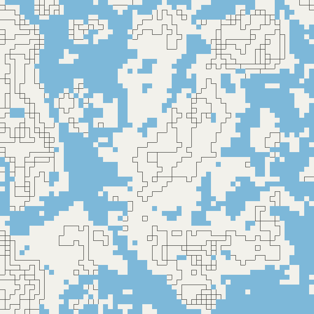
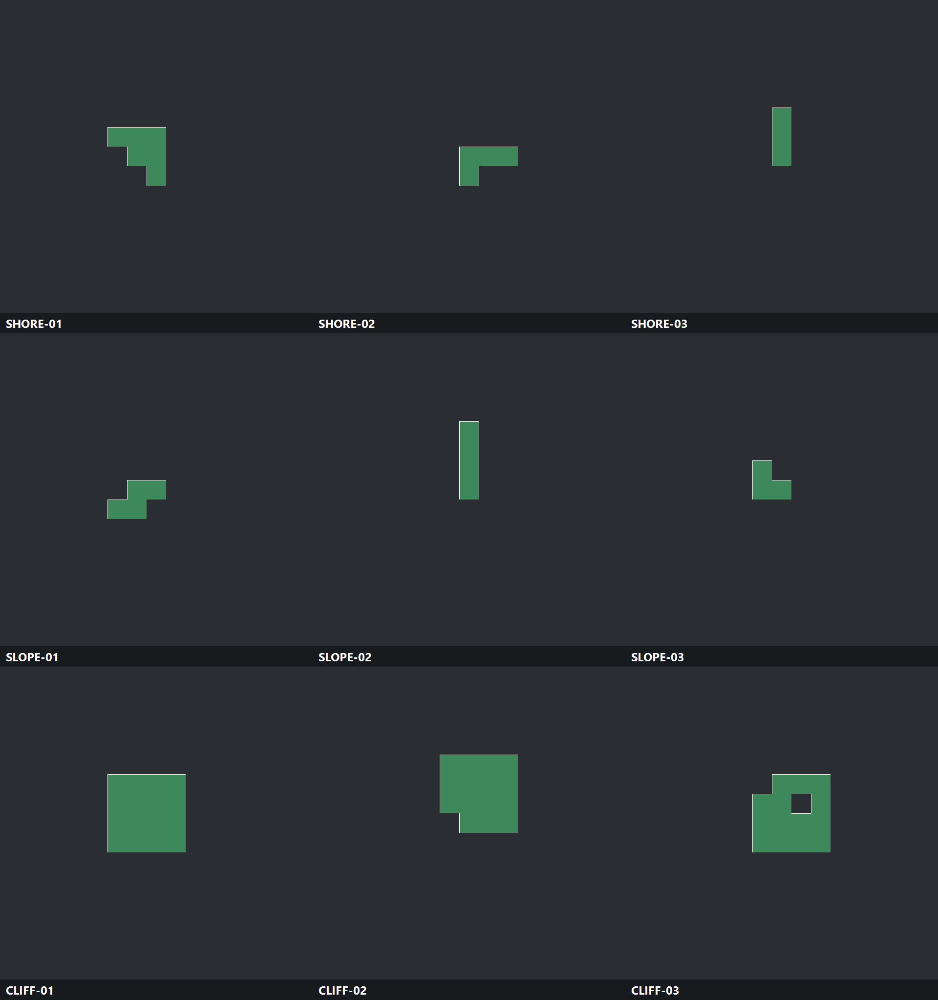

# Patch候选高程高亮预览

## 需求原话

稍等，感觉这个方案好像用不了啊，感觉是不是还不如做那种高度图？就是区块的颜色随着高度变化的，这个等高线图完全看不懂我感觉。

而且我觉得待选patch的图应该是在图里高亮出来而不是另外再生成一张

ok先生成策划案后，改改吧

我觉得这样完全不好看，这样看不出各个patch之间的关系啊。

应该这样就好了：
T选择城市的阶段，直接先是总览的原图，然后再是在这个原图上，叠加上所有的top的patch高亮的图，并且每种patch的色号范围应该是确定好的吧

D也同理

我觉得不论是T还是D，都得有一张所有的patch都标记出来的图

## 示意图

## AI 需求总结

### 高程作为主底图

候选预览改为**随高度连续变色的高程图**，让人和AI能直接判断哪里高、哪里低；水体继续保持独立颜色，山体阴影只作为高程底图上的轻量立体辅助，不再用难以快速阅读的纯等高线作为主图。

### 同框总览

T和D都先返回覆盖整个当前选择范围的原始地形总览，再以完全相同的范围返回Patch叠加图；所有图片中的同一位置必须能够直接对照，不能再按单个候选分别取景。

### 两种Patch叠加图

每个阶段都必须有一张标出当前范围内**所有Patch**的总览图；选择候选时，再在同一张原始地形总览上叠加当前各类型的Top Patch，让人和AI直接判断不同候选之间的相邻、间隔和整体分布。

### 固定色号

每种地貌Patch使用T和D共同固定的色号；原始地形图、所有Patch图和Top Patch图保持相同边界、比例和底图，Patch使用准确边界高亮，不使用候选包围盒代替实际形状。

### 选中后确认

单候选的局部精细预览不再用于批量比较；只有选中候选后，才生成城市尺度的高程高亮确认图。
