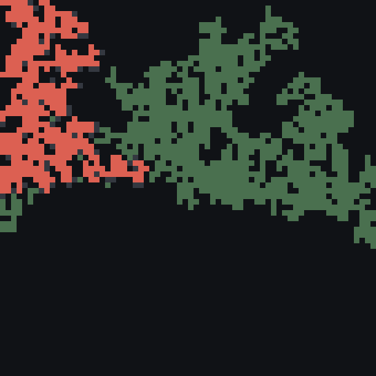
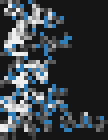
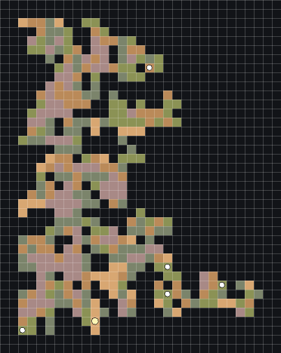

# T4城市候选分级精扫选址

## 需求原话

我们的T阶段拿到的领土粗略地图，支不支持我们给这个国度选城市啊，我感觉是不是有点够呛啊，我就是很担心step的问题，是不是我们的T阶段的图也可以拆开为多张更高精度的图，不然AI也看不清吧

嗯嗯确实，选址单独写一个案子吧

话说咱这样只用了群系，会不会漏掉很多漂亮的地形啊，而且mc中的plain是不是也可能是山

现在这种patch的图你看得清楚吗，人工看的话肯定能慢慢看清楚哪个patch是哪个，因为我之前确实见过你拿错patch了，而且就算人工看其实也是很密

是不是每种patch取个top n就够了，然后不管哪个阶段都给纯净的等高线图（这里面就能含海陆信息）+山体阴影图+patch图

我现在的想法就是不按照群系生成候选了，而且改用patch来生成候选，也是看三种图

patch太碎是不是算法问题，不过也不好说，这里step那么大，但是太碎的地方对于一个城市的选址来说重要吗

行，那先按照这个改一版吧

## 示意图

原始图片路径：`E:\Mod_Dev\StructureBinder\run\realm_debug\rtf0810_medium_city_20260810_01\territory_preview.png`

原始图片路径：`E:\Mod_Dev\StructureBinder\run\realm_debug\rtf0810_medium_city_20260810_01\realm_t4_terrain_preview\realm_salt_kingdom_0_coarse_height_water_preview.png`

原始图片路径：`E:\Mod_Dev\StructureBinder\run\realm_debug\rtf0810_medium_city_20260810_01\city_candidates\realm_salt_kingdom_0_city_candidate_map.png`

## AI 需求总结

*国境总览*：T阶段的领土粗略地图只负责判断沿海、内陆、边境或国土中心等宏观分布，不能单独决定城市最终落点。

*候选真值*：候选不再按群系连续区生成，直接使用已有地貌Patch；群系只作为附加事实，每种地貌类型默认只展示面积排名靠前的少量候选。

*候选三图*：每个候选固定生成同范围、同方向、同分辨率的等高线含水体图、山体阴影图和单候选Patch图，图内不叠加其他候选名称或密集标签。

*城市尺度确认*：选中候选后以更小步长重绘同组三图；确认不合适时回到候选比较，而不是等到城市内部规划才首次看清地形。

*按需精扫*：三图只围绕每种地貌当前展示的Top N候选生成，细碎Patch可以作为周边地貌出现在等高线和阴影图中，不要求全部进入首页候选。

*D3分工*：T4负责把候选地形看清，City D3继续负责最终局部复核，不应再成为第一次发现候选内部真实地形的阶段。
