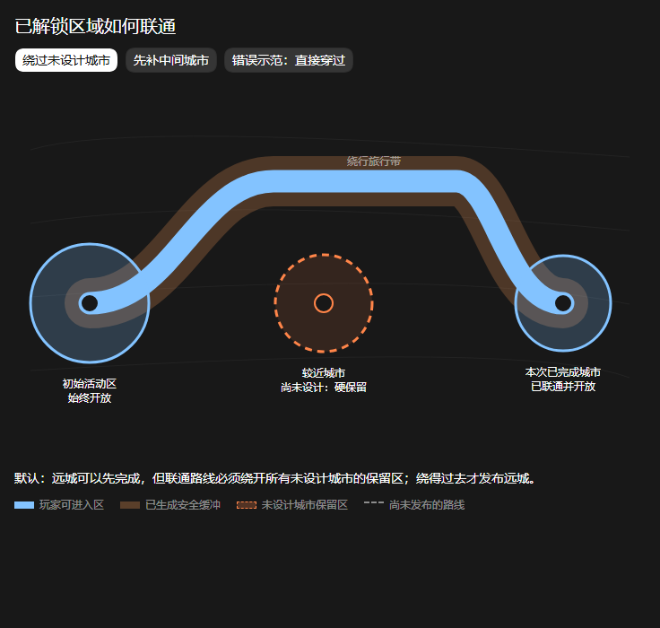

# 初始活动区与规划区域开放

## 需求原话

> 我现在的设想是，只要使用了这个mod，进入世界后除了已经设计完的地方，禁止TP，玩家有一块初始活动区域，你看看这个区域给多大比较好。
> 这一片地方不会设计城市和国度。

> ok，应该可以写入案子了

> 那我感觉好low，尤其是对于走路的限制，我看有的mod会使用世界边界这种来阻挡玩家，也有的会走到一定范围会施加黑暗效果并几秒后将玩家传送回边界。
> 而且如果走路不能拦截的话，一定会出现玩家跑图导致城市无法生成落地的情况的

> 而且新生成的边界也得改改，不能只是以城市围一个圈，这样玩家从初始位置根本就走不过去，只能tp

> 麻烦用示意图看看你打算怎么处理已解锁区域呗，就是这段联通的路怎么处理，我最担心的是Agent本次设计完成的城市不是最近的，联通的路会路过其他未设计的城市

## 示意图

## AI 需求总结

### 初始活动区

新世界以 **0,0** 为中心保留默认半径 **2048 格**的玩家初始活动区，这里不设计城市和国度；该半径允许整合包作者配置。

### 首批城市距离

第一批城市从距离原点至少 **3072 格**的位置开始，该距离允许整合包作者配置。

### 区域进入限制

初始活动区外，只有已经完成设计、生成安全并正式解锁的地方才能进入。尚未解锁的区域不仅**禁止 TP**，也必须阻止玩家通过步行、飞行或载具继续跑图；边界需要提供玩家能够感知的阻挡或警告，例如世界边界式阻挡，或在接近后出现黑暗等效果并把玩家送回安全区域。限制必须确保玩家及其视距不会提前生成未来城市所在区域，避免城市完成设计后无法正常生成落地。

### 连通式区域解锁

新城市不能只开放城市周围一个孤立圆圈。每次解锁都必须把**已有开放区、通往新城市的连续旅行区域和新城市区域**一起开放，使玩家能够从初始活动区或既有城市全程步行抵达；TP 只能作为便利手段，不能成为进入新城市的唯一方式。

### 未设计城市保留区

所有尚未完成设计的城市位置都属于**硬保留区**，新开放的旅行区域不得从中穿过。即使 Agent 本次先完成的是更远城市，只要能够在不触碰其他未设计城市的前提下安全绕行，就可以沿绕行路线建立连续开放区；这条路线应当保留玩家正常旅行和沿途活动的空间，而不是只开放一条狭窄直线。

### 较远城市的开放门禁

如果通往较远城市的合理路线必然穿过另一座未设计城市，或绕行会变得明显不合理，那么较远城市只能保持**设计完成但尚未解锁**，不能为了立即开放而穿过保留区，也不能只开放一个供 TP 进入的城市孤岛。此时应先完成并解锁作为联通前置的中间城市，再继续开放通往较远城市的后续区域。
