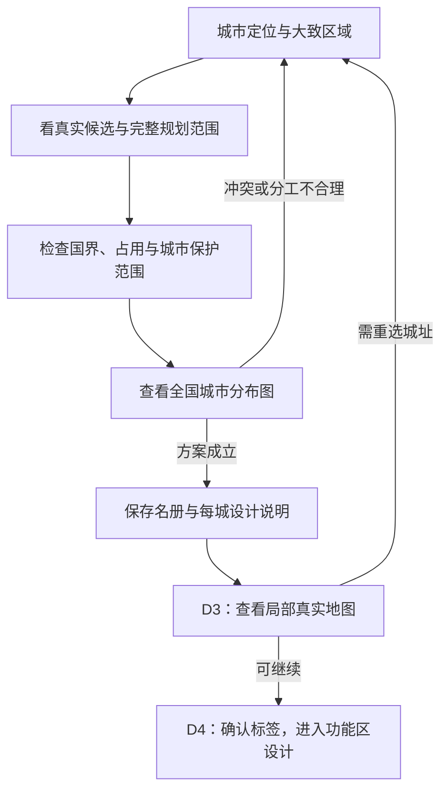

# 选址与交接

让第二题的城市方案通过正式选址复核，再把已经做出的设计决定交给单城流程。**设计中案**；[返回纵览](README.md)。

## 全国分布和实际选址一起复核

<small>原话：“根据第二题的流程看更个预览图和功能、风格配置池，决定锁定本次的结构选择决策和城市设计思路”</small>

**AI 总结：** AI 先有城市定位与大致区域，再比较实际候选；看全国分布图时，同时判断各城的位置、规模、服务关系是否合理。需要修改就调整方案并重看结果，不能把“分别找到可用地块”直接当作全国设计完成。

检查覆盖城市的完整规划范围，保留现有国界、已占用区域与城市保护范围检查。地图上的规划框不等于实际建成区，也不能偷偷缩小框来获得通过。实验的粗地图坐标是设计参考，进入正式名册前仍须经过正式选址复核；D3 再提供局部真实地形。

## 第三题承接决定，简短确认后继续

<small>原话：“感觉目前其实第三题A的部分，是不是其实只是给第二题的结果再套了一层，感觉可能真的还是有点啰嗦了”</small>

**AI 总结：** 单城开始时直接拿到国度背景、本城设计说明和局部地图。AI 确认采用的功能、分项风格标签与一句设计思路，随后进入公共设置和功能区设计；不再重写第二题的城市介绍。

局部事实确实需要调整时，保留城市原本的服务目的，明确变更哪一项及原因。设计说明与最终采用的选择保持一致，让下一步知道哪些决定仍有效。

## 选址复核不提前替代阵列与落地

<small>原话：“看阵列的这块是得跑到真实的Java类的算法里的”</small>

**AI 总结：** 第二题完成城市定位与粗选址，不预排逐栋建筑。进入 D4 后，再按功能区查结构、设置阵列、调用真实算法看预览；普通水域和高差的设计放行、实际地形适配沿用[城市设计与完整落地案](../../../../../10_product/城市设计与完整落地/README.md)，不把实验粗检通过当成施工已经可行。

后续依次衔接[功能区设计](../../../../city/10_product/案子/具体流程的案子/30_D4蓝图编译/按功能区设计城市/README.md)及其生成流程。居民等附属设计仍是之后的步骤。
