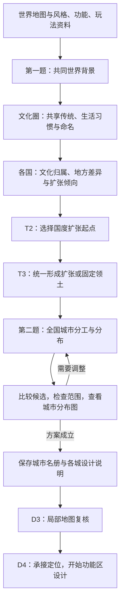

# 国度与城市设计正式接入

让 AI 在 Mod 内完成世界与国度构思、全国城市设计，并把每座城的定位交给后续单城设计。**实现当前案 · 2026-10-06**；用户确认接管实现。

第一题主要对应 T1，明确交付世界概述、文化圈表与国度表；文化圈构思是正式步骤，各国说明文化归属与地方差异。第二题主要对应 T4，继承这些设定安排全国城市；T2、T3 是两题之间的正式选址与领土扩张步骤。

## 把实验中的设计过程接入 Mod

<small>原话：“我觉得还有一步，就是把第一、第二题实现到我们的mod里，因为这俩目前也只是停留在实验”</small>

**AI 总结：** 将两题中已形成的设计方法纳入正式任务，让 AI 能在游戏提供的材料和工具中连续完成设计，成果由游戏保存并传给下一步。已有世界扫描、国土扩张和选址检查继续承担各自工作；实验中的人工搬运资料与补录结果不再成为必要步骤。

| 内容 | 阅读位置 |
| --- | --- |
| 看哪些材料，怎样形成文化与国度 | [世界与国度](01_世界与国度.md) |
| 全国需要哪些城市，各城有什么作用 | [全国城市](02_全国城市.md) |
| 怎样复核选址，把设计交给下一步 | [选址与交接](03_选址与交接.md) |

展示方式沿用[城市风格与功能选择](../城市风格与功能选择/README.md)，下游见[城市设计与完整落地总览](../../../../../10_product/城市设计与完整落地/README.md)。本案负责两题的正式设计与交接，不接管大陆开放和城市生成队列的排序。

## 保留国家数与城市数量范围

<small>原话：“我感觉国家数和城市取值范围确实还是能够保留”</small>

**AI 总结：** 保留国家数配置，以及每国城市数量的上下限（含首都）。AI 在本局配置内设计国家和城市组合；实验不受测试限额约束，不表示正式游戏取消数量配置。

## 扩张消耗跟随国家设定

<small>原话：“我最初的设计是打算由AI根据国家的设定，比如矮人族遇到水扩张力消耗大，山地消耗比其他文明小这样”</small>

**AI 总结：** AI 根据本国设定决定不同地形的扩张消耗，程序按这些选择统一计算领土。地形适应能力要真正影响扩张结果，不能只留在背景文字里；具体表达见[世界与国度](01_世界与国度.md#扩张消耗来自国家设定)。这一分工已明确。

扩张总量与国土面积边界是另一层控制，本次未决定是否调整其现有规则，不与地形消耗混为一项待补参数。

固定岛屿国度可声明完整陆块与指定近海，领土阶段核验并保存固定范围，不参与向外扩张；详见[固定岛屿国度与近海范围](01_世界与国度.md#固定岛屿国度与近海范围)。
