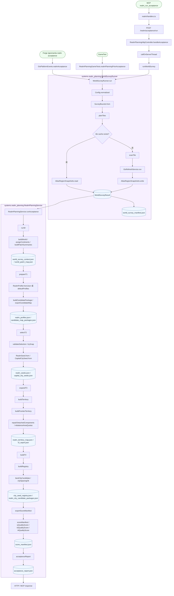

# 国度规划 W-T 代码流程图

本文用来定位当前实现调用链。它可以帮助 agent 或开发者从入口跳到类、方法和产物，不重新定义产品边界。

## 读图口径

- 左上是入口层，紫色分组是主要实现类边界。
- `WorldSurveyRunner` 复用 GIS 刷新服务逐 tile 生成 sealed W 结果。
- `RealmPlanningService` 是 T 阶段主服务，负责 W 汇总、T1、T2、T3、T4 和评分产物。
- 图中 JSON / PNG 产物默认写入 `run/realm_debug/<runId>/`。
