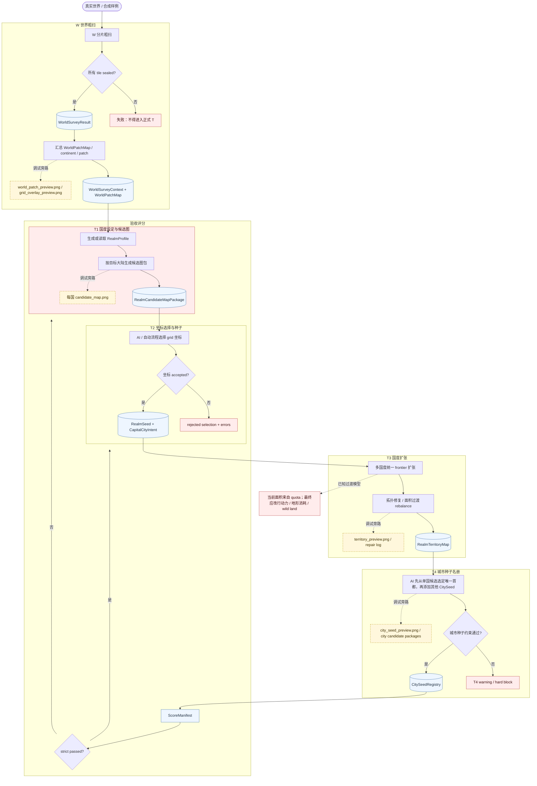

# 国度规划 W-T 设计 Review 流程图

本文用来人工 review 国度规划 W / T 主链的阶段责任。它回答“过程设计有没有越界”，不替代 `../flows/W-T主链实现指南.md` 的代码调用说明。

## 读图口径

- 实线是正式阶段数据流；虚线是调试 / 人工 review 旁路。
- `WorldSurveyResult.sealed=true` 是 T 阶段正式规划前置条件。
- 当前 T3 的 frontier 扩张已经修复连通性问题，但面积仍由 quota 过渡模型驱动；这不是最终行动力模型。
- T4 只生成 `CitySeedRegistry`，不创建城市实例，不进入 C 阶段内部规划。
