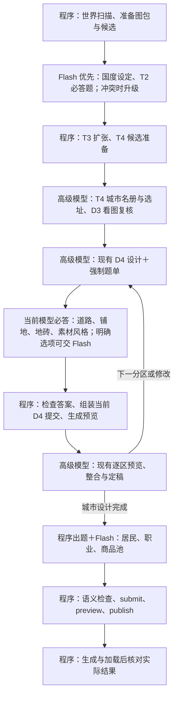

# 模型分工与填空题流程草案

状态：双角色端口及必答检查已实施，并完成下述范围的真实验收。下文保留方案说明；实际接口以下方落地记录及正式契约为准，不能把示意题号直接当成 MCP 参数。

持续接力入口：高级外部 Harness 使用 `planning_next`，Mod-Harness 由 MCP 设置的高级/Flash 两个接管开关控制，可同时接管；两侧 API、Key、模型独立配置，现有配置沿用为 Flash。高级端完成一项任务后继续调用总调度，等待 Flash/程序时不结束本轮；准备好后获得自己的任务。另一个 session 也从同一入口恢复，旧端未释放时等待。Flash 开关关闭、缺 Key 或错误停机时明确提示；取消等待使用 `planning_release`。这不包含自动唤醒已经结束的外部聊天，具体状态见正式契约。

已落地：双角色 MCP 端口与共享租约、Flash T1/T2/附属任务路由及升级；D4 `designAnswers` 必答、逐组作者风格/地基/材质一致性检查，旧草稿用 `city_d4_answers` 补答并保留空间布局；居民上下文提供实际功能词，提交前拦截住房/岗位零命中。独立 Harness 已真实调用配置的 deepseek-v4.1-flash，T2 候选选择在游戏副本中 accepted；T1 经环境修复及一个大陆引用修正后落地。高级端等待与第二 Flash 被拒绝抢占也已实测。

当前 D4 空间设计由高级模型连同题单一起完成，不为选材额外切换一次模型。`roadConnected` 回答核对的是 `allowRelationConnection` 规划许可，实际道路可达与视觉效果仍须当前预览检查。`styles` 对必需结构及补充池成员的作者标签复验；偏离城市风格需明确例外理由。公共余地已有 `CityDistrictPlanner` / `CityPublicGreeneryPlanner` 路径，GENERATE 下可在无显式台地时处理受控绿地；PRESERVE 会绕过这条路径，不能拿换地砖代替生成。

真实居民验收：Flash 经 5002 在约两分钟内完成穗木城方案，发布创建 27 人；住房 16 栋、32 个住位、岗位缺口为 0。进入城市查到 4 个当前加载实体，正常保存退出后仍持久化 27 人。D4 本轮做自动化回归，未重建五城做视觉验收；原世界旧方案未自动改写。

验证与已知限制：[实施记录](E:/Mod_Dev/StructureBinder/dev_docs/systems/realm_planning/archive/8c1b8833_v0.1.0_双角色规划与必答检查/任务记录.md)。后文“拟新增/尚需实现”等描述是方案基线，具体进度以上述记录为准。

用户要求：
> “程序按照流程直接列本次流程的所有问题，AI做填空题就得了”
> “结合现在代码的实现写成文档……像城市设计这块目前我们都搞好了的”
> “设定和T2其实给flash干也可以”
> “就算是高级模型也得有问答题……是否铺路，选什么地砖……选的什么风格的素材……都是必须要拷问的”
> “flash模型走另一个MCP端口……不能让俩个agent抢”

**模型档位和必答题是两件事：高级模型也必须答题，不能凭一段设计说明跳过配置。** 国度设定和 T2 改为 Flash 优先，遇到候选不适用、约束冲突或难以判断的地形再升级高级模型；D4 空间设计保留高级模型与现有流程。所有模型共用必答题、选项约束和提交检查，Flash 是否胜任具体任务仍需用项目样例验证。

## 1. 优化后的实际顺序



这不是新增一轮城市设计，也不要求为了几道题额外切一次模型。当前高级模型可以直接答完整题单；可独立批处理的明确选项才交 Flash。选材题在该建筑组引用确认前回答；道路与地表题在 overview / district 提交前回答；不能等 D4 finalize 以后再补铺地。

## 2. 已做好的部分保留什么

| 流程 | 默认模型与职责 | 现有出口 |
| --- | --- | --- |
| 国度设定、T2 国度核心 | Flash 优先，按题单结合候选图作答；约束冲突、候选都不合适或地形难判断时升级 | `realm_t1_prepare`、`realm_t2_select_coordinate` |
| T4 城市选址和名册 | 要看地形、相互距离、首都与卫星城关系 | T4 选首都、加城市工具 |
| D3 复核 | 要看局部地形，判断接受还是重选 | `city_review_d3_site` |
| D4 总览、分区构图 | 已有城市设计流程；建筑数量、阵列、朝向关系、空间比例继续由它决定 | `city_d4_overview`、`city_d4_district` |
| D4 整合、最终看图 | 要判断空间效果及功能是否保留 | `city_d4_mark`、`city_d4_integrate`、`city_d4_finalize` |

W、T3、候选查询、ID 绑定、版本号、哈希、预览执行、普通居民分配都由程序做，不给 Flash 另出“怎么执行”的题。

### 国度设定和 T2 的具体题目

| 题目 | 默认由 Flash 填写 | 现有字段 |
| --- | --- | --- |
| 国度叫什么、主题是什么？ | 名称、简短主题 | `realmProfiles[].name/theme` |
| 文化、产业、材料倾向是什么？ | 分项标签；材料倾向须核对作者可用目录 | `cultureTags/industryTags/materialTags` |
| 喜欢和避开什么地形？ | 两组明确选项 | `landformPreferences/avoidLandforms` |
| 规模多大？ | 优先级、目标/最小/最大面积比例 | `scalePlan.priority/targetAreaRatio/minAreaRatio/maxAreaRatio` |
| 如何扩张？ | 亲水、紧凑、沿海、资源、边境偏好 0～1；山地/森林偏好 -1～1；跨海策略 | `expansionStyle` 对应各字段 |
| T2 选哪块候选？为什么符合设定？ | 候选编号、根据候选证据填写理由 | `patchSelectionRef`、`reason` |

`realmId`、目标大陆和归一化分组等上下文字段由程序从当前任务绑定；需要设计决定的值必须有明确来源，不能用隐藏默认值代替。现有 `RealmProfileInput` 已检查字段完整性、数值范围和面积比例顺序；新题单还要检查回答与候选证据的对应关系。看图本身不作为强制升级高级模型的条件。

## 3. 选材：当前模型必须填什么

**出题前已有：**高级模型定好的建筑组、功能要求、城市风格；作者提供的结构功能、角色、风格标签；`city_d4_materials` 可查询的候选目录。

程序先联合过滤功能、角色、风格，再列出候选。不能只按功能找到了就结束；选项里没有合适的，必须允许回答“无合适候选”。不能由 Flash 自造结构 ID，或自行放宽风格。

| 本组问题 | 当前模型回答形式（高级 / Flash 相同） | 程序写入现有字段 |
| --- | --- | --- |
| 本城、本组允许哪些素材风格？ | 城市风格选择；本组明确继承或填写受约束的例外及理由 | 城市已有 `styleProfile`；结构风格白名单及逐组例外需新增约束记录，不能把 profile 当作已实现的标签检查 |
| 本组哪些结构必须出现？ | 从候选卡选择一个或多个编号 | 建筑组 `requiredStructureRefs` |
| 其余建筑采用哪个补充池？ | 从可用池选编号，或明确不使用 | 建筑组 `fillPools` / `fillPoolRef` |
| 使用多个池时，各池相对权重多少？ | 按所选池填数字 | `fillPools` 的权重 |

**示例题面：西湾互助领的诊所组。**

```text
已确定：城市风格为精灵；本组需要诊疗功能。
程序列出：本次目录中同时满足功能、角色、风格的候选卡。
题 1：必需结构选哪些？[候选编号多选 / 无合适候选]
题 2：补充池选哪个？[合格池编号 / 不使用]
Flash 答案示意：题1=[A]，题2=不使用。
```

A 是题单临时编号，只有题单实际列出 A 才能选；程序把 A 映射成真实 `structureRef`，并显示选中结构的作者风格标签。沙漠诊所即使功能合适，也不能混进这个默认候选集合。若设计确实需要混搭，退回高级模型填写具体结构、风格差异、混搭理由和适用范围，再重新出题；高级模型也不能凭“我是高级模型”绕过约束。与明确要求冲突的例外不能通过。

**不是 Flash 的题：**该组造几栋、怎么排、占多大面积、摆在哪块地。这些留在现有 D4。候选仅靠标签仍不能保证视觉协调，实际预览继续由高级模型复核。

现有 `city_d4_materials.materialSelections[]` 已支持 `groupId`、`filters.roles/functionIds/functionMode/styles`、`structureRefs`、`fillPoolRefs`。拟新增的是出题、强制联合筛选和提交时复验；目前浏览筛选不等于提交约束。

## 4. 地表：每个建筑组必答，不能漏成 PRESERVE

**空间范围由现有 D4 决定；设计模型必须回答道路、地表和材料题。** 若把材料选择交给 Flash，它只填已确定范围内的选项。程序枚举当前分区实际的建筑组，逐组产生题目，不能让 AI 自己记得还有哪组没填。

| 必答问题 | 当前模型回答形式（高级 / Flash 相同） | 现有落点 / 缺口 |
| --- | --- | --- |
| 本城采用什么道路方案？每个普通建筑组如何接入路网？ | 道路方案编号；逐组列连接对象/关系，确需孤立则填写范围和原因 | `roadProfile`、组间 `relations`、组内 `connectionPlan` 与 `expansionPolicy.allowRelationConnection`；不是新增一个能控制全部道路的布尔开关 |
| 本组哪些范围铺地，哪些不铺？ | 指定已有范围；不铺须有明确设计原因 | 按地基/台地、景观、公共余地分别落地；不能用一句“自然风格”替代处理方案 |
| 已设计的地基/台地生成是否覆盖此组？ | 是 / 否；否要选明确原因 | 本分区 `foundationGroupIds`；使用真实建筑组 ID |
| 道路和地面具体选什么地砖？ | 必须选材料方案/实际方块，或明确继承并确认程序展开的实际材料；不能只填“协调的地砖” | `surfaceMaterials.groups[groupId]`；全城默认在 overview 的 `surfaceMaterials.defaults`；道路覆盖在 `surfaceMaterials.roads[roadKind]`，如 `roadSurface` 槽 |
| 建筑之间的公共余地如何处理？ | 受控铺装 / 受控绿地 / 经设计确认的保留区域 | **当前不能完整独立表达，需要补实现** |

overview 先回答全城道路方案、默认材料、素材风格；district 逐组回答接路、铺地、材料继承/覆盖及风格继承/例外。整合后如果新增组、换素材或改范围，程序重新打开受影响问题；finalize 必须确认当前蓝图没有缺答或失效答案。

```text
D4 每组答案示意（问题编号为拟新增协议）：
接路：接入当前主街；引用本次题面已有的连接关系。
铺地：纳入本组地基生成；公共余地采用题面可用的受控处理方案。
地砖：继承全城方案；确认程序展开显示的具体方块清单。
素材风格：继承精灵风格；确认所选结构作者标签均符合，无例外。
```

程序必须把这四项与实际蓝图比对。写了“铺地”而生成列表为空、回答精灵却选择沙漠结构、接路关系实际不存在，都不能凭文字回答通过。

例如程序发现本分区有“住宅组、工坊组、集市组”，就必须返回三行答案。少一行阻止提交；不能把空列表自动解释成“都不铺”。“不造台地”也不能自动解释成“公共地表保留原始生态”。

当前 overview 的 `citySettings.outdoorPlan.mode` 只有 `GENERATE/PRESERVE`，district 提供 `foundationGroupIds` 和 `landscapes`。`CityOutdoorBlueprintCompiler` 遇到 PRESERVE 会关闭相应室外来源及剩余地表处理；道路仍可存在。单独换 `surfaceMaterials` 只改已有槽位材质，不能凭空产生缺失的公共地面。

因此先做两件事：

1. 对已有能力，强制回答每组是否纳入生成、用什么材料；禁止缺答静默转成 PRESERVE。
2. 对“无台地也要处理公共余地”，补充独立表达与编译能力后再开放对应选项，不能把尚未实现的选项当成修复。

新景观的几何范围、景观阵列及视觉构图仍由高级模型设计；这里不把 `landscapes` 全部变成 Flash 自由填写。

## 5. 居民：一城一张题单，不逐个编普通 NPC

现有居民分配已经是程序算法。要改的是规则输入和发布前检查，不是再设计一套“程序生成居民”。

**程序出题前应准备：**本城已定稿蓝图、实际使用的建筑功能标签、已有职业模板、可用商品池、继承后的默认配置。已有 `extensionTask` 携带的资料直接复用；只有缺少模板详情时再调用 `realmfolk_planning_read`。

| 题号 | 实际要问的问题 | Flash 填什么 | 对应现有字段 |
| --- | --- | --- | --- |
| N1 | 哪些本城功能标签作为住房？ | 从真实功能候选多选，不写自由文本 tag | `plan.overrides.housingTerms` |
| N2 | 按住房容量还是固定人口？ | `housing` / `fixed` | `plan.overrides.populationMode` |
| N3 | 住房模式下，每屋人数、入住比例是多少？ | 人数 1～8；比例 0～1 | `residentsPerHouse`、`housingOccupancy` |
| N4 | 固定人口模式下目标多少人？ | 0～256，仅 fixed 时出题 | `population` |
| N5 | 本城用哪些职业？ | 选择已有职业；确有差异才选“本城变体” | `plan.overrides.jobs`、提交体 `professions` |
| N6 | 每个职业的最低数、上限、相对权重？ | 三个数字；显示模板默认值供保留 | `jobs[职业ID].min/max/weight` |
| N7 | 每个需要工作地点的职业用哪些建筑功能？ | 从本城真实标签多选；或明确该模板不要求工作地点 | 职业模板 `workplaceTerms` |
| N8 | 是否需要有姓名的关键人物？ | 无 / 姓名、职业、简介列表 | `plan.keyPeople` |

N1/N7 候选还要说明作者定义的用途，不能拿任意标签凑数。共有模板需要改工作地点时，程序复制为本城职业变体，避免改变其他城市。职业能力、装备、生命值等默认继承模板；只有明确提出特殊需求时才展开附加题。

**穗木共社的具体回答例子：**

```text
程序题面：本城存在“家庭居住”功能；旧默认住房词未命中。
N1：选择“家庭居住”对应候选。
N2：housing。
N3：每屋 2 人；入住比例 0.85。
N5～N7：逐个选择职业及本城可用工作地点，不能直接沿用不命中的默认词。
N8：无，或明确填写关键人物。
```

前三题映射到现有提交体中的这段配置：

```json
{
  "plan": {
    "overrides": {
      "housingTerms": ["家庭居住"],
      "populationMode": "housing",
      "residentsPerHouse": 2,
      "housingOccupancy": 0.85
    }
  }
}
```

这只是字段映射片段，**不是可单独提交的完整请求**。程序还要合并原计划、职业及 economy。现有 map/list 是整字段替换，不能把一题答案直接作为完整计划提交而清掉其他配置。

不承诺上述三题一定生成某个精确人数；最终还受可站立位置、售房/玩家房产、职业配额等限制。职业权重也不是精确职业人数。

## 6. 商品配置：和居民题一次返回

| 问题 | Flash 填什么 | 现有字段 |
| --- | --- | --- |
| 本城偏重哪些商品池？ | 作者池编号及 0～10 权重 | `plan.economy.pools` |
| 各档商品比重多少？ | 已有档位编号及 0～10 权重 | `plan.economy.tiers` |
| 使用哪个价格档？ | 从作者提供的价格档编号选择 | `plan.economy.priceBand` |
| 有交易能力的职业售卖哪些已选池？ | 池编号；明确说明空列表代表使用本城所选池 | 职业 `itemPools` |
| 展示多少商品槽位？ | 1～54，默认保留模板值 | 职业 `stockSlots` |

Flash 不创建物品、不逐件定价。程序检查职业商品池与本城所选池交集，避免“商人配好了却无货”。

## 7. 程序怎样“逼问”，而不是只换一段提示词

每次进入一个任务，程序生成完整题单：题号、当前值、允许选项、必答条件、所绑定的真实字段。当前模型一次返回本任务全部答案；高级模型和 Flash 遵守相同协议，条件题随选项启用。题号仅用于新问卷协议，不是现有 MCP 工具参数。

**高级模型自主决定设计，但不自主决定哪些必答项可以省略。** 自由设计结果仍填入现有 D4 结构化字段；题单约束不能退化为提示词里的“请记得检查”。默认值须展开供明确确认，缺答不能当继承，写了理由也不能抵消代码与答案不一致。

程序执行顺序：

1. 冻结本次候选和上下文版本，模型只选编号或填写受限数字/短文本。
2. 缺答、非法编号、风格不符、住房零命中、工作地点不匹配，返回具体题号与原因；只补对应答案。
3. 程序组装现有完整请求，代填 contextId、workflowRevision、baseRevision、哈希等机械字段。
4. 居民沿用 `realmfolk_planning_submit → preview → publish`；预览 token 必须来自当前草案。资料齐全时不额外重复拉取相同上下文。
5. 无合适候选、需要风格例外、需要改空间布局时，升级给高级模型；不能自行选一个不匹配的结构或无限重试。
6. 已由高级模型处理时仍执行相同拦截；修改后只重开受影响题目，答案与蓝图版本绑定，不能拿旧答案为新蓝图过关。

需要区分两个检查时机：

- **城市尚未加载：**根据蓝图及结构元数据检查计划能否匹配住房和岗位；站立容量尚不能确认时明确标为待运行时验证。现有 preview 的 `towns:[]` 不表示零人口验证通过，也不能硬性要求当场 created > 0。
- **城市已加载：**核对实际房产、站立位置、目标人口和创建结果。目标应非零却实际零人时给出原因；`future_only` 是生效范围，不是“成功有人”的证据。

## 8. 落到现在代码上，需要改哪里

| 位置 | 已有能力 | 本方案新增内容 |
| --- | --- | --- |
| `RealmProfileInput`、T2 工具 | 国度设定完整性检查、候选引用提交 | Flash 优先题单、候选证据校验及异常升级 |
| `ProviderPlanningToolCatalog`、`CityD4Workflow` | D4 阶段、字段与操作限制 | 所有模型共用必答门槛；道路/铺地/地砖/风格答案与蓝图比对，变更使相关答案失效；保持城市设计主链 |
| `CityMaterialCatalogBrowser`、`CityBlueprintValidator` | 标签查询、引用合法性检查 | 联合候选、持久化本组风格约束及例外、提交复验 |
| `CityOutdoorBlueprintCompiler`、`CitySurfaceMaterials` | 室外生成与材质覆盖 | 必答覆盖检查；补独立公共地表语义与执行 |
| 主 Mod `PlanningExtensions`；Realmfolk `CityPlanningExtension` | 扩展任务、上下文、完成回执 | 把本城蓝图的住房/岗位证据送入题单；复用已返回资料 |
| Realmfolk `CityPlanning`、`PopulationPlanner` | 提交发布、人口分配 | 计划匹配检查与加载后结果核对，不重写人口算法 |
| Harness `HarnessAgentClient` | 按配置发送 `model` | 若需自动切换高级/Flash，新增按任务角色路由；当前未据此实现 |

外部 MCP 按下节分成高级模型、Flash 两个角色端口，由对应 Agent 连接。服务端可以控制端口领取什么任务，但不能仅凭端口证明客户端实际用了哪个模型；模型配置仍由调用方负责。内置 Harness 可在自身调度中实施模型路由。

### 双 MCP 端口，共用调度和占用锁

**两个入口，一份任务状态，同一时刻只有一个任务执行者。** 先沿用当前世界级串行规划边界，不为双端口另开两条可同时修改存档的规划链。

| 入口 | 可领取的任务 | 没有对应任务时 |
| --- | --- | --- |
| 高级模型 MCP 端口 | D4 空间设计、当前指定的高级任务、Flash 提交的升级请求 | 返回等待状态，不领取 Flash 任务 |
| Flash MCP 端口 | 国度设定、T2、独立配置题单、居民/商品配置 | 返回等待状态，不抢 D4 或已被占用的任务 |

端口可配置、必须互不冲突；本稿不指定第二端口数值，也不修改现有运行配置。当前 `McpServerConfig` 只有一个 `port`，默认 5001；双角色监听尚需实现。两个监听器必须引用同一个世界的 `PlanningSessionService`，不能各自创建独立租约或复制任务队列。

程序负责以下规则，不能只在提示词里要求两个 Agent 自觉避让：

1. **先判角色，再原子领取。** 任务声明允许的角色；领取时同时检查角色、任务状态和占用者。错误端口不能通过提前调用 resume 抢走另一角色任务；角色身份也不能由模型在参数中随意改写。
2. **两个 Agent 使用不同身份和凭据。** 所有变更请求校验任务、占用者、有效租约和当前版本；不能复用同一个 owner/token，不能从旧工具入口绕过检查。
3. **交接由程序完成。** 例如高级模型已保存当前 D4 草稿，需要 Flash 填材料题：先保存版本及待答问题，再结束当前执行权、将题单交给 Flash。高级模型此时只能等待；Flash 完成后程序校验并保存答案，再将预览复核任务交回高级模型。不是高级模型一直持锁、Flash 在旁边另改同一草稿。
4. **升级也走交接。** Flash 发现无合适候选时提交阻塞原因与证据，由程序把该任务转给高级模型；不能双方同时重做。
5. **断线后不能接受旧结果。** 连接层维持心跳，避免模型正常思考期间被误当失联；确认租约失效后才允许重新领取，并更换执行凭据。旧 Agent 恢复后的提交必须被拒绝，即使它提交的仍是同一城市。正在执行的请求未结束时不得强行转交。
6. **重复请求不重复推进。** 同一任务同一执行轮次的提交/发布应返回已有结果；已完成任务不能被另一个端口再次领取。存档恢复后重新校验任务版本和执行权。

当前 `PlanningLease` 已有世界级 owner/token、120 秒续期及执行中禁止过期转交的保护，`PlanningSessionService` 已有心跳与作用域入口。应在这套机制上补角色调度和明确交接；不能认为“分了两个端口”就自动拥有上述全部保证。尤其 `planning_release` 当前会清除准备中的会话状态，不能直接当成已实现的交接协议，交接前必须持久化草稿及题单。

新增验收：两端同时领取只成功一个且角色正确；占用期间另一端不能写；交接后旧 token 提交失败；超时重领后旧答案失败；重复发布不重复生效；高阶→Flash→高阶的草稿和题单版本连续。状态信息应明确显示当前由谁处理、另一端在等待什么。

建议先完成选材/地表防漏与居民匹配校验，再接 Flash 路由。否则换便宜模型仍会复现同样的合法但错误的提交。

验收直接复用本次问题：四座城不能因为缺答变成空铺地；西湾诊所不能只凭功能混入不合风格的结构；穗木必须命中“家庭居住”并检查岗位；未加载城市可以完成规则发布，但结果须区分“已发布”和“加载后已生成人口”。

新增验收：同样的漏答分别由高级模型和 Flash 提交，必须同样被阻止；“已回答”但字段不一致仍被阻止；整合改动后的旧答案不能直接定稿。国度设定/T2 默认路由 Flash，冲突案例升级后仍需完成原题单。

## 9. 实现依据与关联文档

- [现行 AI/程序分工案](../10_product/案子/AI场景策划与程序执行分工-v0.1/README.md)
- [现行结构选材要求](../../city/10_product/案子/具体流程的案子/00_跨阶段主线/聚落空间与地表升级/01_结构选材与阵列表达.md)
- [现行公共地表要求](../../city/10_product/案子/具体流程的案子/00_跨阶段主线/聚落空间与地表升级/03_城区地表与公共绿化.md)
- [D4 工具字段](E:/Mod_Dev/StructureBinder/src/main/java/com/rinsing/geomantia/systems/provider/application/ProviderPlanningToolCatalog.java)
- [D4 状态机](E:/Mod_Dev/StructureBinder/src/main/java/com/rinsing/geomantia/systems/city/application/CityD4Workflow.java)
- [现有规划租约](E:/Mod_Dev/StructureBinder/src/main/java/com/rinsing/geomantia/systems/provider/application/PlanningLease.java)
- [现有规划会话](E:/Mod_Dev/StructureBinder/src/main/java/com/rinsing/geomantia/systems/provider/application/PlanningSessionService.java)
- [现有 MCP 端口配置](E:/Mod_Dev/StructureBinder/src/main/java/com/rinsing/geomantia/platform/mcp/McpServerConfig.java)
- [居民配置字段](E:/Mod/_Dev/国度冒险附属Mod/src/main/java/com/rinsing/realmfolk/design/Design.java)
- [居民规划提交与发布](E:/Mod/_Dev/国度冒险附属Mod/src/main/java/com/rinsing/realmfolk/design/CityPlanning.java)

以上代码路径为本机实现位置；问卷题号、候选卡、模型路由和新增拦截均为本稿提议，不能作为已上线接口调用。
