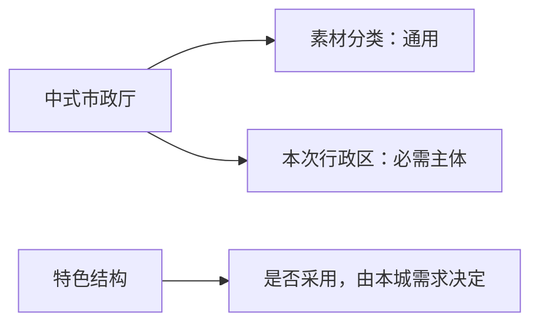
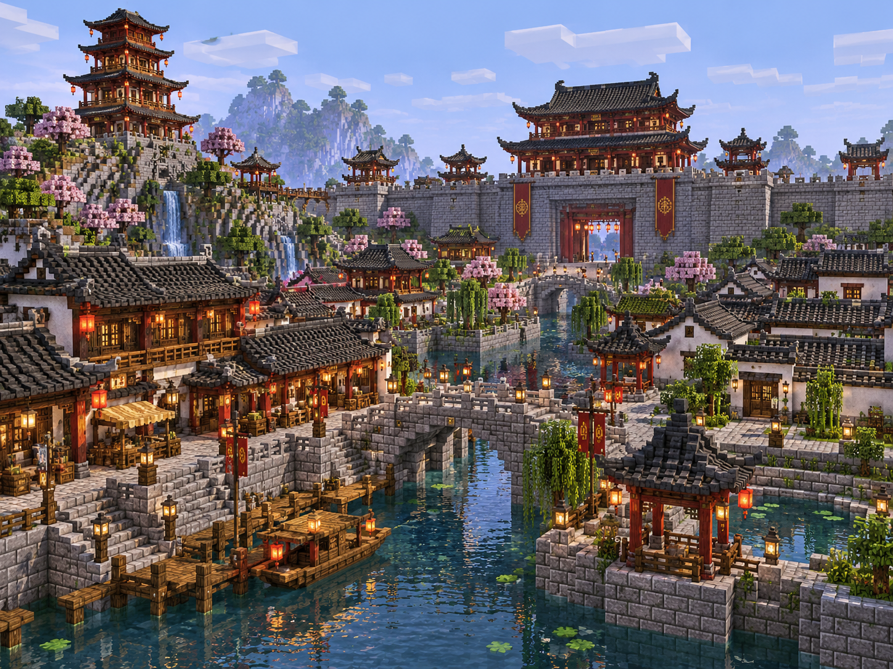
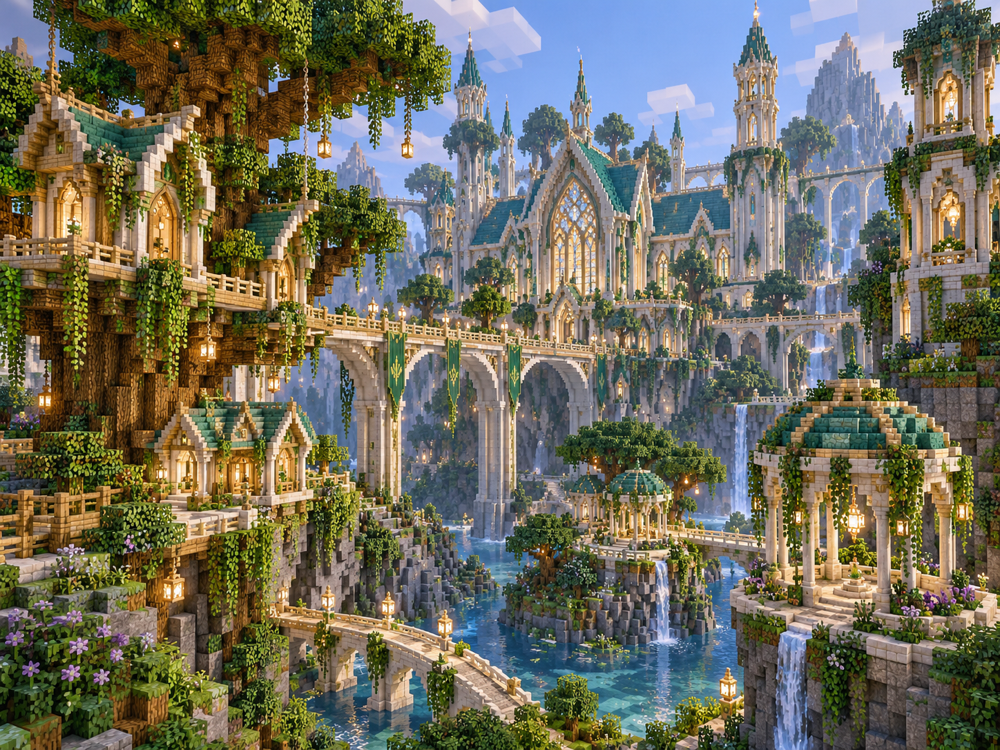

# 风格素材与配套

**实现当前案（素材分类与运行时选材）· 2026-10-07**。[返回总览](../../../10_product/城市设计与完整落地/README.md)。本批接管素材类别、功能与配套标签的运行时接入；换皮部分继续保留设计中状态。

每种风格既有建筑，也有能配成城市的景观与基础设施。素材自身的类别与本次城市里的重要程度分开。

## 素材分特色与通用

<small>原话：“或者我觉得都不应该叫核心，而是叫特色，通用则是是指的是这个风格里，这种功能是长啥样子而已，比如非常重要的市政厅，都是每个风格都可以有的”</small>

**AI 总结：** 风格素材采用**特色／通用**的区分。特色强调该风格有辨识度的结构表达；通用体现常见功能在这个风格下的样子，不表示各风格长得一样。

市政厅可以属于通用素材，同时成为本次行政区必需的主体。**本次核心和填充由功能区设计决定**，不从素材类别直接继承。具体哪些结构列为特色，待素材清单确认。

## 每种风格有配套结构

<small>原话：“我们也应该每种风格至少配一套配套的结构”</small>

**AI 总结：** 风格清单同时准备适合自身表达的**地面、桥梁和植被景观**。房屋、配套结构分别可选，使中式房屋也能搭配精灵幻想树木或草地，不强制整套同风格使用。功能标签帮助检索，代表图帮助辨认形体。

以下是用户提供的两张风格参考，表达形体与氛围，不代表模型已存在，也不要求复刻地形或整座城市。

[中式参考原图](assets/风格配套/中式风格参考.png)

[精灵参考原图](assets/风格配套/精灵风格参考.png)

## 保留形体，通过换皮复用

<small>原话：“就比如中式特有的石拱桥结构，换个皮就可以换成其他的砖块。”</small>

**AI 总结：** 石拱桥的拱形结构可以保留，另选桥身材料；树木、景观也只开放实际支持替换的部位。换材料不自动改变桥型、树形或用途。

作者标明可换部位，城市如何统一及精修见 [换皮案](../../../systems/city/10_product/案子/具体流程的案子/00_跨阶段主线/城市分项风格与换皮/README.md)。桥梁能否适应实际跨度、高差并接通两端，属于 [落地案](../../../systems/city/10_product/案子/具体流程的案子/40_D5至D7边界与激活/城市设计完整落地/README.md)的适配问题。

## 作者标明可替换部位

<small>原话：“而mod里的那种也可以导入后由整合包作者标记”</small>

**AI 总结：** 自建和导入素材都需要明确哪些部位可换、可以换成什么。AI 依据这些标记配置，不根据方块名称猜测整栋结构该怎样替换。
