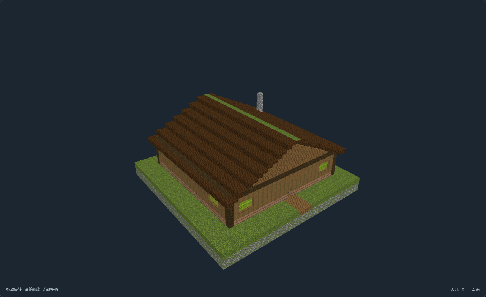

# 第三题：松霁尝试报告

**工具链受阻，尚未进入有效设计提交与编译；不是设计验收失败。** 本次完成材料读取、入口核验、离线候选筛选、单体看图与输入准备，没有最终城市布局或D4预览。

目标保持第二题松霁 yucen_songji，X=-7744、Z=9664，village，半径256。使用 experiment_q2_songji_20261002 独立实验登记，不冒充正式T4审批。没有重选T4、重扫D3、重启客户端或生成建筑、居民，也未读取旧第三题答卷。

## 实際进度与证据

| 环节 | 结果 |
|---|---|
| 读取材料 | inputs/ 保存题面、第二题设定与答案、完整D3材料；已查看地貌与群系图 |
| 服务与工具 | 5000服务在线，debugRoot匹配指定存档；tool_schemas.json为实际MCP listTools返回 |
| D4准备 | calls/01_prepare.*：city_prepare_d4_blueprint_context 返回 PROVIDER_MANAGED_CITY_SOURCE_INVALID: TerraSenseStructureProfileSource.official.json |
| 查询选材 | catalog_statistics.json及query_01～05保存本地作者资料筛选和已有素材查询CLI结果；不代表运行时查询成功 |
| 提交设计 | 缺contextId、冻结目录引用及workflowRevision，未伪造提交；准备稿在drafts/design_v01.unsubmitted.json |
| 调用编译 | calls/02_compile.*：city_compile_d4_blueprint 返回 CITY_BLUEPRINT_CONTEXT_NOT_FOUND；这是入口探测，不是某份设计编译失败 |
| 预览与修订 | 没有D4结果可看；完成住宅尺寸条件放宽、跨风格客栈看图后淘汰，不能称为布局修订 |

## 版本与边界

参考分支codex/offline-structure-studio，HEAD 192d4379724099827507bb756c4523864ba7ec37；新worktree为d7cd2b3f0610623872909b1b107caac69038bb16。本次以参考仓入口为准，未修改实现、配置、分支或未知未跟踪文件。运行客户端字节码版本未独立验证，不能由源码HEAD推定。详见evidence/version.json。

Mac无powershell/pwsh，启动检查未执行，没有现场DUE信号，不触发清理。D4生成种子尚未提供，不虚构种子。上游材料及候选NBT保留快照与哈希。本次没有对照实验，不作输入精简优劣结论。

## 读地形

规划框1024格：535坡地、371平原、79山脊、25崖壁、9未知、5山谷；高程71～107，无水体格。forest 880格、old_growth_birch_forest 143格、birch_forest 1格。群系概览是49×49周边范围，图例计数不是城内统计。16步长数据是生成器先验estimated_coarse_heightmap，不是逐块实测，无水体格也不能证明供水已解决。

地貌图高Z在上，不把画面上方当北。72 Patch包含周边上下文，平原03整体包围框不是一整块矩形可建地。terrain_reading.json仅对原始地形格聚合，没有替代原实现做落位、碰撞或可施工检查。

## 选材与参数准备

本地作者目录534条，精灵53条：核心5、填充46、明确选用2。这是作者资料数，不是运行时可用数。已有名称查询CLI在“中式＋建筑与城市配套”条件下返回0，仅限这份目录和条件，不能推断所有来源都没有中式建筑。

查询01：精灵＋木器制作/工具维修/编织/餐饮/种子销售，共5条。查询02：精灵住宅≤35×35，无匹配；查询05放宽到49×49后12条，优先选择较小独立住宅。查询03跨风格旅客/商旅住宿29条，用来检查缺口，不作为默认填充来源。

| 组 | 候选及尺寸X×Y×Z | 数量与组织意图 | 编译保留情况 |
|---|---|---|---|
| 木作修补 | FS-F01-v06作坊37×25×37；FS-F01-v04修理铺42×26×34；FS-F01-v03织品店43×25×31 | 各1，木作为功能中心，短院并保留后场搬运 | 未编译 |
| 旅居餐食 | FS-04-v01兽驿43×24×35；FS-F01-v01食铺32×25×29 | 各1；兽驿为条件候选，畜群空间与本城需求尚需核对 | 未编译 |
| 家庭生活 | FS-01-v01住宅37×28×31；FS-01-v02长屋43×28×36 | 2＋1座，短列朝公共步道 | 未编译 |

8座仅为首轮意图，不铺满规划框。作坊搜索框X[-7984,-7872)、Z[9696,9792)，42格高程77～81、最大slope=3；住宅框X[-7984,-7872)、Z[9792,9888)，高程71～80，不能忽略局部起伏；接待框X[-7872,-7808)、Z[9744,9840)，高程76～80。框仅为读图意图，不是落位结果。

精灵候选作者入口north、地坪脚底相对Y=3；初稿保留原向。运行时可旋转性、锚点与朝院关系待验证。正式district schema使用preferredPatchRefs/Zone而非任意世界坐标，未把搜索框塞入接口。父阵列意图是作坊居中、接待与住宅邻接，不强制对称；算法profile、组合profile没有冻结引用，未编造名称或执行排布。

**没有获得运行时填充池，不能声称筛选已约束填充。** 作者ID不是runtime structureRef；作坊作者角色fill，也不伪装成运行时已批准核心。完整池成员、精确白名单表达与重复数量均待工具接通后确认。

已实际查看作坊、修理铺、矮人客栈、住宅正面及兽驿去顶图。棕木坡屋顶、绿窗并不能单凭精灵标签证明中式院落细节已满足。MF-08-v03虽然功能匹配，深色石构偏重，看图后未采用。兽驿接待和生活空间可讨论，但动物通路、住宿用途及供水仍为条件项；不承诺NPC服务。

8份候选NBT均匹配既有validation的NBT哈希；当前author与旧review顶层author哈希不一致，目录说明曾改标，因此旧验收不能直接担保当前元数据。本次没有重做单体完整验收，详见materials/manifest.json。

以下是**已有单体素材图，不是D4城市编译图**：

## 最小缺口与流程观察

1. **先恢复可解析的托管素材源与相应目录绑定。** prepare实返官方TerraSense source无效，日志也记录内容包安装失败。需与客户端匹配的已审核profile、template/reference目录及实际模板可用性；本地NBT存在不等于已恢复运行条件。本次未安装或生成新内容包。
2. **还需要明确的独立实验接入方式。** MCP prepare说明要求D3对应Top Patch review，本题要求省略。当前失败尚在素材源阶段，后续审查拒绝没有实测，不能写成已遇到的第二个错误。需显式离线入口复用原D4编译、渲染及地形/碰撞/范围/道路预留检查，不伪造审查凭证；现有离线循环尚未确认接通。
3. **上下文依赖阻断了运行时查询。** materials、提交、预览都要求contextId及流程版本；上下文失败使池成员核对与合法提交无法继续，这是接口依赖，不是模型选偏。
4. **用途与风格标签需要原图辅助。** 编织不自动等于修补，兽驿不自动等于纯旅宿。建议查询同时显示实际尺寸、原始用途、运行时可用状态及图片，并保留完整匹配数。
5. **筛选到填充是否一致尚不能判断。** 未取得运行时池，不能宣称发生池污染；应在下一次核对完整成员与实际保留清单。
6. **没有布局反馈，不能评价阵列好坏。** 当前无碰撞、裁减、范围或道路检查结果，无最终城市PNG；D3和素材图均不顶替结果。下一步应恢复入口后从准备稿查询绑定，不重做选址、不沿用旧答卷。

交付文件：inputs/上游快照；calls/真实请求返回；tool_schemas.json实际契约；query_*.json筛选证据；drafts/design_v01.unsubmitted.json未提交准备稿；materials/候选原文件和原图；evidence/现场状态、日志与版本。最后有效上游仍是本次提供的D3，尚无可交给第四题的有效D4版本。
