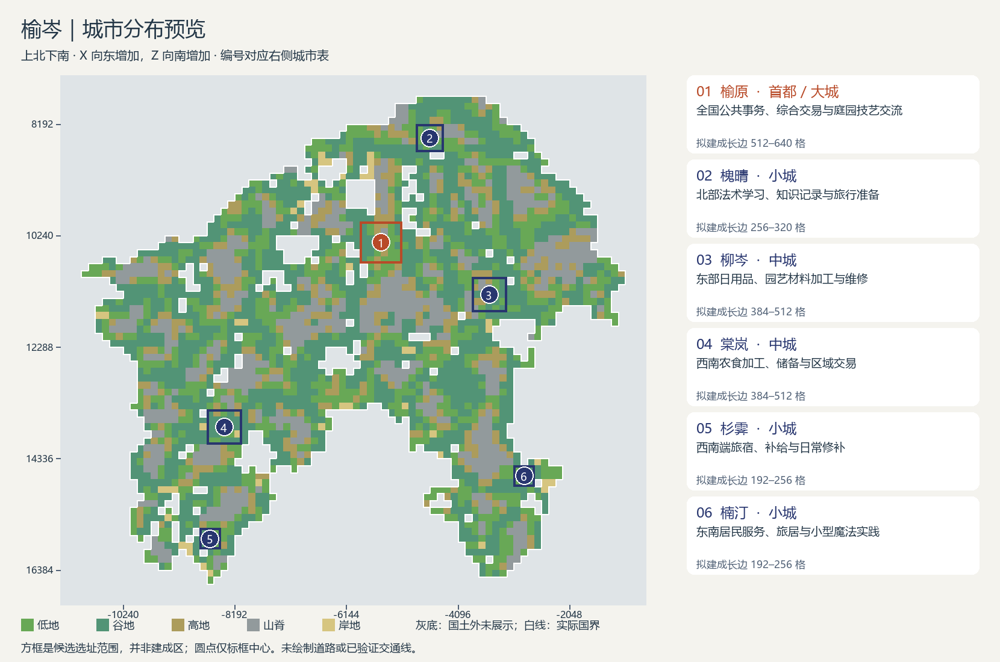

# 第二题：榆岑城市设计

## 城市分布概述

规划六城，采用“一大、两中、三小”的规模组合。首都 **榆原** 设于中北部低地、谷地较集中的内陆区域，承接公共事务、日常交易与庭园技艺交流；北面的槐晴补充法术学习和干地生活试作，东面的柳岑承担材料加工与维修，西南方向的棠岚支撑农食集散，杉霁与楠汀分别服务两条南伸陆地的居民和旅行者。主要联系是榆原—棠岚—杉霁、榆原—柳岑—楠汀及榆原—槐晴之间的物资与人员往来意向，不代表已有道路或可通航航线。城市之间保留村落、生产地与连续荒野，不把南部两支之间的水域当作已验证的捷径。

## 城市设计表

**读表口径：** X 向东增加，Z 向南增加，坐标单位均为方块；下列矩形为粗尺度候选范围，采用左闭右开区间 `[下限, 上限)`，逐格核对均在 owned 国土内且无内部非国土空缺。规模是拟议城市主要建成部分的长边量级，不是已验证施工面积，不包含周边村落及农业腹地；各城均有基本居住与公共生活，表中突出决定定位的差别。

表内 T、M 为候选范围内温度、湿度参数的算术均值，均为 0–1 参数；H 为各粗格高度中位数的范围，R 为格内高差 P90−P10 的范围，后二者单位为方块。所有产业、消费习惯、风格选择和城市服务均为本方案设定，地理数值才是资料事实。

| 城市名 | 大致位置（X/Z区域）与选址依据 | 规模及国度中的作用（标明首都） | 主要职能、特色生产与消费 | 模组组合、玩家活动及关键需求 | 风格取向与环境依据 |
|---|---|---|---|---|---|
| **榆原** | X `[-5888,-5120)`，Z `[9984,10752)`，中北部；36 格中低地、谷地各 15 格，H 67–93、R 1–20，T 0.566、M 0.632，适合作为较大城市的优先精扫对象。它位于北端与南部两支之间，但距南部仍远，需由地方城市分担服务。 | **大城、首都**，长边约 512–640；承担全国公共议事、技艺交流和综合交易，也服务中北部村落。 | 以粮蔬与日用品市场、种苗花木交换、木作修补和公共共餐为基础，计划制作活木、活石并消费外来织物和器皿；住家菜园拟种胡萝卜、马铃薯，小麦等大宗食材由多地补充。 | **Botania＋Farmer's Delight，辅以 Ars Nouveau 家庭魔法**：玩家经营能实际产出的工作花园，制作材料、备餐并展示自编法术；关键需求是功能花及其运行投入、种苗、食材与独立的法术制作材料，不把首都设成所有进阶内容的唯一入口。 | 以中式灰墙木梁、瓦檐为主，精灵式植被穿插作为生活与生产表达；低地、谷地占多数且温湿参数适中，支持较舒展的庭园形象，仍保留少量起伏带来的高低变化。 |
| **槐晴** | X `[-4864,-4352)`，Z `[8192,8704)`，北部；16 格中低地、谷地共 14 格，H 69–94、R 3–21，T 0.583、M 0.019，显著偏干。选择相对缓和的地形设置小城，不因北部空间可用就扩大高耗水生产。 | **小城**，长边约 256–320；服务北部常住居民及学习者，承担法术试作、知识记录与旅行准备。 | 计划发展抄录装订、工具零售、羊毛织补与耐储食物采购，消费面包、烤马铃薯；以小块小麦、甜菜试种和少量畜群照护维持地方生活，大宗鲜蔬从其他地区补充。 | **Ars Nouveau＋原版生产生活**：玩家组合符文、试验法术与魔法帮手，也准备书写材料、羊毛和干粮；关键需求是法术解锁所需材料、魔源宝石及按实际配方配置的魔源，不以“干燥”设定施法增益。 | 沿用中式院落语汇，但选择更克制的花木和有遮阴感的檐廊形象；极低湿度参数构成节制用水与植被密度的设计理由，不能据此称这里是沙漠或已有旱生群系。 |
| **柳岑** | X `[-3840,-3200)`，Z `[11008,11648)`，东部内陆；25 格含低地 6、谷地 10、高地 4、山脊 5，H 70–111、R 3–54，T 0.556、M 0.678。混合地形支持有坡地特色的城镇，但显著起伏限制连续扩张。 | **中城**，长边约 384–512；作为东部日用品、园艺材料与维修中心，分担首都的生产任务并联系南伸陆地。 | 计划发展木器、工具维修、材料回收及活木、活石加工，交易花木、零件和普通建材；以马铃薯、胡萝卜及面包供应居民和作业者，不把所有生活消费缩成魔法材料。 | **Botania＋原版手艺活动**：玩家配置花卉、Mana 产生与传输，制作庭园工程所需材料并改进生产过程；关键需求是持续的花卉及运行投入、木石原料和可维护性，矿料与金属允许外购，不预设本地矿藏。 | 木梁灰墙与精灵式自然形态共同出现，强调顺应起伏的轮廓而非统一铺平；较湿润的参数支持繁茂庭园的审美选择，但山脊、谷地混合不等于已证实森林或可采木材储量。 |
| **棠岚** | X `[-8704,-8064)`，Z `[13440,14080)`，西南支北段；25 格以谷地 17 格、低地 5 格为主，另有 1 格岸地，H 65–85、R 1–31，T 0.540、M 0.727。较低的高度与较缓的多数粗格有利于优先寻找农食城镇落点，岸地标签不作为港口依据。 | **中城**，长边约 384–512；承担西南区域农食加工、储备与交易，并向首都及杉霁提供补给。 | 周边村落拟种小麦、胡萝卜、马铃薯和卷心菜，城市集中加工、备餐与种苗交换，少量畜养供应蛋肉；地方消费突出蔬菜料理、面包和共餐，农业腹地不计入城市规模，也不宣称全国粮食由一城包办。 | **Farmer's Delight＋Ars Nouveau**：玩家从种植、收集食材走向切配烹饪，再试作适配农事的魔法帮手与自动化；关键需求是可用耕地、食材链、厨房工具及独立魔源供应，具体兼容对象与效率待版本实测。 | 中式日常家宅、瓦檐和生产性植被为主，保留精灵式木构细节；相对湿润的谷地、低地使有遮蔽感的农居庭园成为地方表达，但不把谷地等同于河流、灌溉或肥沃土壤。 |
| **杉霁** | X `[-8832,-8448)`，Z `[15616,16000)`，西南支南段；9 格为低地 4、谷地 4、高地 1，H 66–78、R 4–11，T 0.382、M 1.000，较其他候选地凉湿。选择缓和地形保留小型常住据点，不继续向狭窄末端扩张。 | **小城**，长边约 192–256；服务西南端村落和探索者，提供归来休养、旅宿及日常修补。 | 计划种植马铃薯、甜菜，兼做羊毛编织、衣物与工具修补，消费热食、面包和储备蔬菜；不足食材从棠岚补充，地方菜谱与待客传统比扩大产量更重要。 | **Farmer's Delight＋原版探索生活**：玩家准备远行餐食，归来整理收集物、补种和做饭；关键需求是稳定食材、燃料、羊毛与维修材料，旅行和休养的吸引力来自补给及经营活动，不假设新增治疗加成。 | 以木构、瓦檐和较围合的家宅形象延续岑岚文化，植被保持可维护的尺度；较低温度与高湿度是温暖室内感、遮蔽感的创作依据，不据此宣称存在降雪、冻土或杉树林。 |
| **楠汀** | X `[-3072,-2688)`，Z `[14464,14848)`，东南支中段偏东；9 格为低地 6、谷地 3，H 69–85、R 5–13，T 0.502、M 0.503。选在局部较缓区域，避开北侧较起伏的地段，并与杉霁分担两支陆地的末端服务。 | **小城**，长边约 192–256；服务东南陆地的居民、旅居者与小型魔法实践者，避免所有维修和学习都要返回北部。 | 计划经营胡萝卜、马铃薯菜园，制作木制日用品并提供食材、工具与园艺材料交换，消费由柳岑补充的加工材料；保留旅客住宿与家庭手艺，不按海港、渔都或海运中心立项。 | **Ars Nouveau＋Botania，配合原版农作**：玩家在小规模经营中比较自编法术、魔法帮手与功能花的用途，制作旅途所需物品；关键需求是各自独立的魔源与 Mana 链、基础材料补给，城市特色是就近实践与长期居留而非新增专属法术。 | 木梁浅灰墙与精灵式植被交织，形成体量较轻的小城形象；低地、谷地及中等温湿度支持这一审美选择，地名“汀”是文化意象，不作为河岸、水源或码头已存在的证据。 |

## 必要补充

- **联系与分工。** 棠岚向各城供应计划内的农食加工品，柳岑补充木作、维修和庭园材料，榆原汇集日常交换与作品交流；其他城市及村落也生产相同作物，允许多源供应。北部与两条南伸陆地都保留地方服务，接受一些功能重复，以减少长距离往返；上述联系只规定需求，不预绘交通线。
- **对外交换。** 已知榆岑与纳希尔接壤，可延续织物、器皿、食材与庭园作品的交换意向；现有五图和本题 JSON 不标出纳希尔共享边界的具体段落，因此不指定任何一城为边贸门户，实际接驳点待补充边界与可达性资料后选择。
- **用地取舍。** 六处候选框合计 120 个粗格，占 2889 格国土约 **4.15%**，且候选框并不全部建设；这只表明本方案保留大量非城市空间，不是土地承载力结论。槐晴因干燥而控制规模，杉霁与楠汀因服务范围和南伸地形保持小城，柳岑尤其避免把低平均高差误读为全域平地；首都选择依据是本轮地形和服务分工，不沿用国家扩张起点。
- **落地核验。** 后续先做 32 格局部精扫和 D3 验证，核查连续可建范围、坡坎、水体及候选范围外的实际可达性；柳岑需优先避让 R 达 54 的粗格，棠岚须核查岸地与周边水体。供水、排水、土壤、作物种苗、木石与矿产来源、畜群条件及供给数量均未实测；槐晴供水、杉霁凉湿场地、各城稳定食材与材料供应是重点，不把气候参数当作游戏内作物限制或增产机制。
- **玩法实现边界。** 模组能力仅采用所给 05 资料的已核实范围，实际版本、配方及自动化兼容性仍需核验；Botania 的 Mana 与 Ars Nouveau 的魔源分别运行，不默认互通。表中议事、市场、学徒展示、教学交流、旅宿、维修、休养和跨城交易首先是城市活动设定：涉及 NPC 授课、收购订单、自动补货、收费住宿、维修服务或任务奖励时，均属待实现机制，不能当作模组原生功能；本轮不引入额外模组，也不设计单城内部结构、道路或施工布局。

资料依据：本题《榆岑_最新国度设定》《设计任务与读图说明》、03—06 素材、01—05 五张地图及《榆岑领土数据.json》《来源.json》。坐标、地貌与环境统计基于同源 128 方块 W 粗格；没有新增群系、矿藏或交通事实。六城均为计划存在的城市，选址仍属于粗尺度原型。
## 城市分布预览

[坐标数据](第二题_榆岑城市设计_20260929_190204.json)。按原答卷坐标补绘，未改变城市方案。
