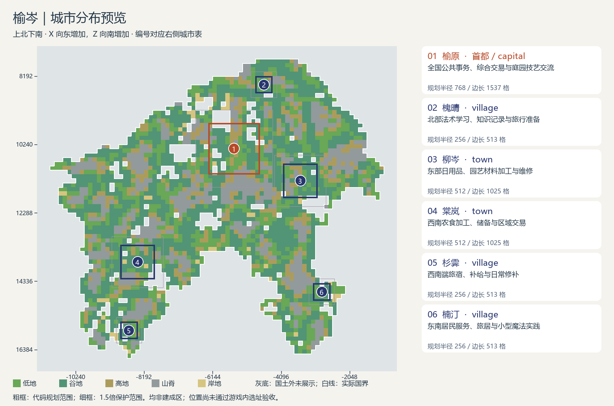

# 榆岑城市方案：代码尺度修订

保持原六城的职能和粗定位中心。本次把首都映射为 capital、原中城映射为 town、原小城映射为 village；这是本次修订选择，不是中文称谓的强制对应。原答卷的候选框与拟建成长边不再作为本版规模依据。

| 城市 | 代码档位 | 粗定位中心 X/Z | 规划半径 | 规划边长 | 规划框涉及非本国粗格 | 主要作用 |
|---|---|---|---:|---:|---:|---|
| 榆原 | capital | -5504 / 10368 | 768 | 1537 | 19/169 | 全国公共事务、综合交易与庭园技艺交流 |
| 槐晴 | village | -4608 / 8448 | 256 | 513 | 2/25 | 北部法术学习、知识记录与旅行准备 |
| 柳岑 | town | -3520 / 11328 | 512 | 1025 | 5/81 | 东部日用品、园艺材料加工与维修 |
| 棠岚 | town | -8384 / 13760 | 512 | 1025 | 7/81 | 西南农食加工、储备与区域交易 |
| 杉霁 | village | -8640 / 15808 | 256 | 513 | 2/25 | 西南端旅宿、补给与日常修补 |
| 楠汀 | village | -2880 / 14656 | 256 | 513 | 2/25 | 东南居民服务、旅居与小型魔法实践 |

六城保护框互不重叠；六个规划框都涉及非本国粗格，均标为**待复选址**。这些粗格可能是国土空洞或边缘，不能直接解释成外国领土或不可建地形。未移动位置、未修改游戏。

半径采用当前源码的默认T4档位换算与CityPlanningConfig裁剪，规划框含两端方块。保护范围采用CityPlanningReservation的1.5倍计算并向外取整。图面范围不代表建筑全部填满，也不是游戏内验收结果。

[原答卷的文化、产业与玩法说明](第二题_榆岑城市设计_20260929_190204.md)继续作为背景参考；原答卷地形统计只覆盖原来的小候选框，不能当作本版扩大范围的统计。

[坐标数据](第二题_榆岑城市设计_20260929_190204_代码尺度.json) · [粗检结果](第二题_榆岑城市设计_20260929_190204_代码尺度.validation.json)
